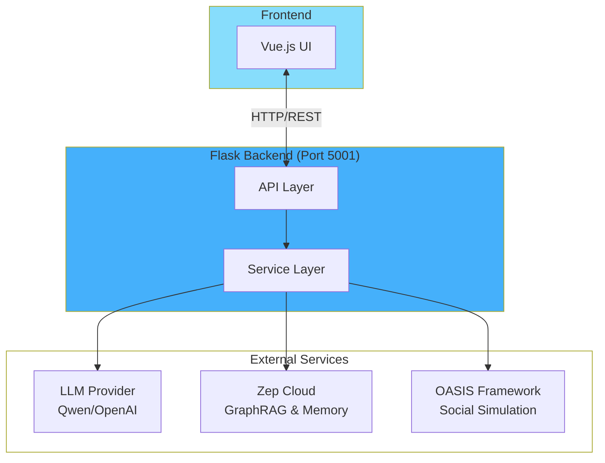
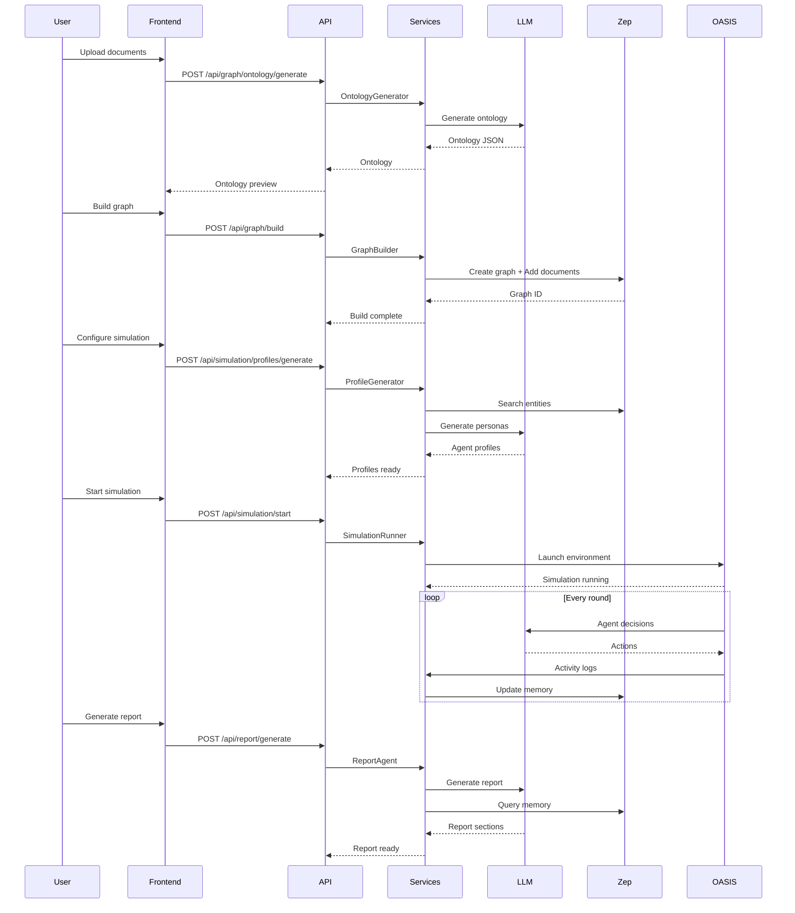

## Overview

MiroFish is built as a full-stack application with a Flask backend API and Vue.js frontend, orchestrating multiple specialized services for multi-agent simulation and prediction.

## High-Level Architecture



## Component Breakdown

### 1. Frontend (Vue.js)

**Location**: `frontend/src/`

**Responsibilities:**
- User interface for uploading seed data
- Visualization of simulation progress
- Report display and agent interview interface
- Real-time status monitoring

**Key Components:**
- `views/`: Page components
- `components/`: Reusable UI elements
- `api/`: API client functions
- `store/`: State management

### 2. Backend API Layer

**Location**: `backend/app/api/`

**Three Main APIs:**

<CardGroup cols={3}>
  <Card title="Graph API" icon="diagram-project">
    Project management, ontology generation, knowledge graph construction
  </Card>
  <Card title="Simulation API" icon="users">
    Entity management, profile generation, simulation execution and monitoring
  </Card>
  <Card title="Report API" icon="file-chart-column">
    Report generation, interactive chat, export functionality
  </Card>
</CardGroup>

**Key Files:**
- `graph.py`: Graph construction endpoints
- `simulation.py`: Simulation control endpoints
- `report.py`: Report generation endpoints

### 3. Service Layer

**Location**: `backend/app/services/`

Core services that implement business logic:

| Service | File | Responsibility |
|---------|------|----------------|
| **Text Processing** | `text_processor.py` | Document parsing and chunking |
| **Ontology Generator** | `ontology_generator.py` | LLM-based ontology design |
| **Graph Builder** | `graph_builder.py` | Zep GraphRAG construction |
| **Entity Reader** | `zep_entity_reader.py` | Entity filtering and enrichment |
| **Profile Generator** | `oasis_profile_generator.py` | Agent persona creation |
| **Config Generator** | `simulation_config_generator.py` | OASIS environment setup |
| **Simulation Manager** | `simulation_manager.py` | Simulation state tracking |
| **Simulation Runner** | `simulation_runner.py` | Process orchestration |
| **Memory Updater** | `zep_graph_memory_updater.py` | Temporal graph updates |
| **Report Agent** | `report_agent.py` | ReAct-based report generation |
| **Zep Tools** | `zep_tools.py` | Memory search and retrieval |

## Data Flow

### Full Workflow



## Key Architectural Patterns

### 1. Asynchronous Task Processing

**Why:** Graph building and report generation are long-running operations (minutes to hours).

**How:**
- Tasks run in background threads
- Status polling via task ID
- Client polls `/api/graph/task/{task_id}` or `/api/report/generate/status`

**Example:**
```python
# backend/app/api/graph.py
def build_async(project_id, ...):
    task = TaskManager.create_task()
    thread = threading.Thread(
        target=_build_thread,
        args=(task.task_id, project_id, ...)
    )
    thread.start()
    return task.task_id
```

### 2. Multi-Process Simulation

**Why:** OASIS simulations need isolated processes for Reddit/Twitter environments.

**How:**
- `SimulationRunner` spawns subprocess for OASIS
- IPC via file system and shared state
- Process cleanup on shutdown

**Example:**
```python
# backend/app/services/simulation_runner.py
process = subprocess.Popen(
    ["uv", "run", "python", "oasis_main.py"],
    env=env_vars
)
state.runner_process = process
```

### 3. Stateful Service Design

**Why:** Track simulation progress, project state, report generation.

**How:**
- In-memory state managers (ProjectManager, SimulationManager, ReportManager)
- Persistent file storage for large artifacts
- State serialization for recovery

**Example:**
```python
# backend/app/models/project.py
class ProjectManager:
    _projects: Dict[str, Project] = {}
    
    @classmethod
    def get_project(cls, project_id: str) -> Optional[Project]:
        return cls._projects.get(project_id)
```

### 4. Tool-Augmented LLM Agents

**Why:** ReportAgent needs to query memory and analyze simulation data.

**How:**
- LangChain ReAct agent with custom tools
- Tools: SearchTool, InsightForgeTool, PanoramaTool, InterviewTool
- Iterative reasoning loop (thought → action → observation)

**Example:**
```python
# backend/app/services/report_agent.py
tools = [
    SearchTool(zep_client, graph_id),
    InsightForgeTool(zep_client, graph_id),
    PanoramaTool(simulation_id),
    InterviewTool(simulation_id)
]
agent = create_react_agent(llm, tools, prompt)
```

## Configuration Management

### Environment Variables

**Location**: `.env`

**Managed by**: `backend/app/config.py`

**Key Settings:**
```python
class Config:
    # LLM API
    LLM_API_KEY = os.getenv('LLM_API_KEY')
    LLM_BASE_URL = os.getenv('LLM_BASE_URL')
    LLM_MODEL_NAME = os.getenv('LLM_MODEL_NAME')
    
    # Zep Cloud
    ZEP_API_KEY = os.getenv('ZEP_API_KEY')
    
    # Flask
    DEBUG = os.getenv('FLASK_ENV') == 'development'
```

See [environment variables](/deployment/environment-variables) for complete reference.

## Scalability Considerations

### Current Limitations

<Warning>
**Single-Instance Design**: MiroFish is designed for single-server deployment. Not horizontally scalable.
</Warning>

**Bottlenecks:**
- In-memory state (no database)
- Single-process Flask server
- Sequential simulation processing

### Future Improvements

<CardGroup cols={2}>
  <Card title="Database Backend" icon="database">
    PostgreSQL for persistent state and multi-instance support
  </Card>
  <Card title="Task Queue" icon="list-check">
    Celery/Redis for distributed task processing
  </Card>
  <Card title="Simulation Parallelization" icon="code-branch">
    Run multiple simulations concurrently
  </Card>
  <Card title="API Rate Limiting" icon="gauge">
    Protect against abuse and ensure fair usage
  </Card>
</CardGroup>

## Security Architecture

### Current State

<Note>
MiroFish is designed for **local deployment** with no built-in authentication.
</Note>

**Security measures:**
- CORS restricted to API routes (`/api/*`)
- Environment variable isolation
- No database (reduced attack surface)

### Production Recommendations

If deploying publicly:

1. **Add Authentication**: JWT tokens or API keys
2. **HTTPS**: Use nginx/Caddy with SSL certificates
3. **Rate Limiting**: Prevent API abuse
4. **Input Validation**: Sanitize file uploads and user input
5. **Secret Management**: Use vault services (AWS Secrets Manager, etc.)

See [deployment guide](/deployment/source-code) for details.

## Monitoring and Debugging

### Logging

**Location**: `backend/app/utils/logger.py`

**Log Levels:**
- `INFO`: Normal operations
- `DEBUG`: Detailed execution traces
- `ERROR`: Failures and exceptions

**Example:**
```python
from app.utils.logger import get_logger
logger = get_logger('mirofish.service')
logger.info("Starting simulation...")
```

### Health Checks

**Backend**: `GET /health`
```bash
curl http://localhost:5001/health
# {"status": "ok", "service": "MiroFish Backend"}
```

**Frontend**: `http://localhost:3000`

## Technology Stack Summary

### Backend
- **Framework**: Flask 3.0+
- **Language**: Python 3.11-3.12
- **Package Manager**: uv
- **Dependencies**: See `backend/pyproject.toml`

### Frontend
- **Framework**: Vue.js 3
- **Build Tool**: Vite 7
- **Language**: JavaScript (ES6+)
- **Dependencies**: See `frontend/package.json`

### External Services
- **LLM**: Qwen/OpenAI-compatible APIs
- **Memory**: Zep Cloud (GraphRAG + temporal memory)
- **Simulation**: OASIS (CAMEL-AI)

---

<Card title="Dive Deeper" icon="book" href="/advanced/oasis-integration">
  Learn how OASIS powers the simulation engine
</Card>
