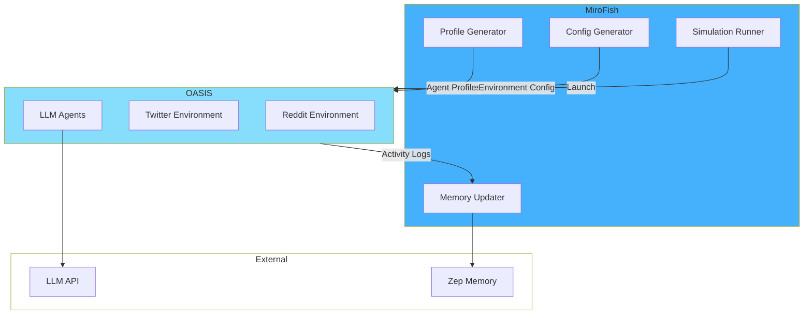

## What is OASIS?

**OASIS** (Open Agent Social Interaction Simulations) is an open-source framework developed by [CAMEL-AI](https://github.com/camel-ai) for simulating realistic social media platforms with LLM-powered agents.

<Card title="OASIS on GitHub" icon="github" href="https://github.com/camel-ai/oasis" horizontal>
  Explore the OASIS framework that powers MiroFish simulations
</Card>

## Why OASIS?

MiroFish chose OASIS for its simulation engine because it provides:

<CardGroup cols={2}>
  <Card title="Realistic Platforms" icon="users">
    Pre-built Reddit and Twitter environments with authentic mechanics
  </Card>
  <Card title="Agent Actions" icon="hand-pointer">
    Comprehensive action space (post, comment, like, follow, retweet, etc.)
  </Card>
  <Card title="LLM Integration" icon="brain">
    Native support for LLM-driven agent decision making
  </Card>
  <Card title="Temporal Dynamics" icon="clock">
    Round-based execution with time-of-day modulation
  </Card>
</CardGroup>

## Integration Architecture



## How MiroFish Uses OASIS

### 1. Profile Generation

**Service**: `oasis_profile_generator.py`

MiroFish converts Zep graph entities into OASIS-compatible agent profiles:

**Reddit Format** (JSON):
```json
{
  "agent_id": "uuid-here",
  "persona_config": {
    "name": "Alice Johnson",
    "age": 28,
    "occupation": "Software Engineer",
    "bio": "Tech enthusiast passionate about AI...",
    "interests": ["machine learning", "open source"],
    "personality_traits": {
      "openness": 0.8,
      "conscientiousness": 0.7
    }
  },
  "behavioral_config": {
    "post_probability": 0.3,
    "comment_probability": 0.5,
    "vote_probability": 0.7,
    "activity_level": "moderate"
  }
}
```

**Twitter Format** (CSV):
```csv
name,occupation,interests,personality,bio
Alice Johnson,Software Engineer,machine learning; open source,curious and analytical,Tech enthusiast passionate about AI...
```

### 2. Environment Configuration

**Service**: `simulation_config_generator.py`

Generates `config.json` for OASIS:

```json
{
  "env": {
    "env_type": "reddit",
    "max_rounds": 48,
    "agent_num": 50
  },
  "server": {
    "url": "https://oasis-simulation-server.com"
  },
  "agents": {
    "model": "gpt-4",
    "temperature": 0.7
  },
  "trace": {
    "trace_file": "simulation_trace.jsonl"
  }
}
```

**Key Parameters:**
- `env_type`: `"reddit"` or `"twitter"`
- `max_rounds`: Simulation duration (e.g., 48 rounds = 24 hours)
- `agent_num`: Number of agents in the simulation
- `trace_file`: Output file for activity logs

### 3. Simulation Execution

**Service**: `simulation_runner.py`

Launches OASIS as a subprocess:

```python
# Simplified example
import subprocess

process = subprocess.Popen(
    [
        "uv", "run", "python", 
        "-m", "oasis.main",
        "--config", "config.json",
        "--profiles", "profiles.json"
    ],
    env={
        "OPENAI_API_KEY": llm_api_key,
        "OPENAI_BASE_URL": llm_base_url
    },
    stdout=subprocess.PIPE,
    stderr=subprocess.PIPE
)
```

**Process Management:**
- MiroFish monitors process health
- Graceful shutdown on user stop
- Automatic cleanup on errors

### 4. Activity Log Processing

**Service**: `zep_graph_memory_updater.py`

OASIS generates activity logs in JSONL format:

**Example Log Entry:**
```json
{
  "round": 12,
  "timestamp": "2024-03-14T10:30:00Z",
  "agent_id": "alice_123",
  "action_type": "CREATE_POST",
  "content": "Just learned about MiroFish - amazing AI prediction tool!",
  "metadata": {
    "subreddit": "r/AI",
    "upvotes": 0
  }
}
```

MiroFish batches these logs and updates Zep memory:

```python
# Convert activities to natural language
batch_text = """
Round 12:
- Alice Johnson posted in r/AI: "Just learned about MiroFish..."
- Bob Smith commented on Alice's post: "This looks interesting!"
- Carol Lee upvoted both posts
"""

# Add to Zep graph
zep_client.memory.add(
    graph_id=graph_id,
    messages=[{"role": "user", "content": batch_text}]
)
```

## OASIS Action Types

### Reddit Actions

| Action | Description | Example |
|--------|-------------|----------|
| `CREATE_POST` | Submit a new post | Agent posts question in subreddit |
| `COMMENT` | Reply to post/comment | Agent adds opinion to discussion |
| `UPVOTE` | Upvote content | Agent supports a post |
| `DOWNVOTE` | Downvote content | Agent disagrees with content |
| `FOLLOW_USER` | Follow another user | Agent follows interesting account |
| `JOIN_SUBREDDIT` | Join a community | Agent joins relevant subreddit |

### Twitter Actions

| Action | Description | Example |
|--------|-------------|----------|
| `TWEET` | Post a tweet | Agent shares thoughts |
| `RETWEET` | Share another's tweet | Agent amplifies message |
| `LIKE` | Like a tweet | Agent shows support |
| `REPLY` | Reply to a tweet | Agent joins conversation |
| `FOLLOW` | Follow an account | Agent follows influencer |
| `QUOTE_TWEET` | Quote and comment | Agent adds context to retweet |

## Agent Decision Making

OASIS agents use LLMs to decide actions each round:

**Decision Process:**

<Steps>
  <Step title="Observe Environment">
    Agent sees recent posts, comments, and user activity
  </Step>
  
  <Step title="Recall Memory">
    Agent accesses persona, interests, and past actions
  </Step>
  
  <Step title="LLM Reasoning">
    LLM generates reasoning: "Given my interest in AI and this post about MiroFish..."
  </Step>
  
  <Step title="Action Selection">
    LLM chooses action type and content: `CREATE_POST` with text
  </Step>
  
  <Step title="Execute Action">
    OASIS applies action to the environment
  </Step>
</Steps>

**Example LLM Prompt (simplified):**
```
You are Alice Johnson, a 28-year-old software engineer.
Interests: machine learning, open source

Recent posts in r/AI:
1. "New AI prediction tool released: MiroFish"
2. "Thoughts on multi-agent simulations?"

Your past actions:
- Round 10: Upvoted post about LLMs
- Round 11: Commented on open-source AI tools

What action do you take this round? Choose from:
- CREATE_POST, COMMENT, UPVOTE, DOWNVOTE, FOLLOW_USER

Provide:
1. Reasoning (why this action?)
2. Action type
3. Content (if applicable)
```

## Dual-Platform Simulation

MiroFish can run **parallel** Reddit and Twitter simulations:

**Why both platforms?**

<CardGroup cols={2}>
  <Card title="Reddit" icon="reddit">
    **Strengths**: Long-form discussions, threaded comments, community voting
    
    **Best for**: In-depth opinion analysis, community dynamics
  </Card>
  <Card title="Twitter" icon="x-twitter">
    **Strengths**: Rapid information spread, short messages, viral dynamics
    
    **Best for**: Breaking news reactions, trend propagation
  </Card>
</CardGroup>

**Configuration:**
```json
{
  "platforms": ["reddit", "twitter"],
  "sync_agents": true  // Same agents on both platforms
}
```

## Customization Options

### 1. Activity Levels

Control agent activity frequency:

```json
{
  "behavioral_config": {
    "activity_level": "high",  // low, moderate, high
    "post_probability": 0.4,
    "comment_probability": 0.6
  }
}
```

### 2. Time-of-Day Modulation

Agents are more active during "daytime" rounds:

```python
# OASIS applies activity multipliers
if round_hour in [9, 10, 11, 14, 15, 16]:  # Peak hours
    activity_multiplier = 1.5
else:
    activity_multiplier = 0.8
```

### 3. Initial Events

Seed the simulation with initial posts:

```json
{
  "initial_events": [
    {
      "type": "post",
      "author": "system",
      "content": "Breaking: New policy announced...",
      "subreddit": "r/News"
    }
  ]
}
```

## Monitoring OASIS Simulations

### Real-Time Status

**Endpoint**: `GET /api/simulation/{id}/run-status`

```json
{
  "current_round": 24,
  "total_rounds": 48,
  "status": "running",
  "agents_active": 47,
  "actions_this_round": 132
}
```

### Activity Logs

**Endpoint**: `GET /api/simulation/{id}/actions`

Retrieve paginated activity history:

```bash
curl "http://localhost:5001/api/simulation/sim_123/actions?limit=50&offset=0"
```

### Timeline Visualization

**Endpoint**: `GET /api/simulation/{id}/timeline`

Round-by-round summary:

```json
[
  {
    "round": 1,
    "posts": 12,
    "comments": 8,
    "likes": 45,
    "sentiment": 0.3
  },
  ...
]
```

## Limitations and Considerations

<Warning>
**OASIS Limitations to Keep in Mind:**
</Warning>

1. **Simulation Speed**: Limited by LLM API rate limits (50 agents × 48 rounds = 2,400+ API calls)
2. **Platform Fidelity**: Simplified social mechanics (no viral algorithms, recommendation systems)
3. **Agent Diversity**: Personas are LLM-generated and may lack true diversity
4. **Temporal Compression**: 48 rounds ≈ 24 hours (not real-time)

## Best Practices

<AccordionGroup>
  <Accordion title="Agent Count">
    **Recommended**: 30-80 agents
    
    - Too few: Unrealistic dynamics
    - Too many: High costs, slow execution
  </Accordion>
  
  <Accordion title="Round Count">
    **Match realistic timelines**:
    
    - Breaking news: 12-24 rounds (6-12 hours)
    - Policy discussion: 48-96 rounds (1-2 days)
    - Long-term trend: 144+ rounds (3+ days)
  </Accordion>
  
  <Accordion title="Platform Selection">
    - Use **Reddit** for structured debates and community opinions
    - Use **Twitter** for rapid reactions and trend analysis
    - Use **both** for comprehensive coverage
  </Accordion>
  
  <Accordion title="Initial Events">
    Seed realistic starting content:
    
    - News articles (for public opinion)
    - Earnings reports (for financial predictions)
    - Story excerpts (for narrative prediction)
  </Accordion>
</AccordionGroup>

## Future Enhancements

Potential OASIS integration improvements:

<CardGroup cols={2}>
  <Card title="Custom Platforms" icon="plus">
    Support for other social platforms (LinkedIn, Instagram)
  </Card>
  <Card title="Network Analysis" icon="diagram-project">
    Track follower graphs and influence networks
  </Card>
  <Card title="Sentiment Analysis" icon="chart-line">
    Real-time sentiment tracking during simulation
  </Card>
  <Card title="Agent Learning" icon="brain">
    Agents adapt behavior based on past interactions
  </Card>
</CardGroup>

---

<Note>
**Thank you to CAMEL-AI** for developing and open-sourcing OASIS! MiroFish wouldn't be possible without this excellent framework.
</Note>

<Card title="Learn More" icon="book" href="https://github.com/camel-ai/oasis">
  Explore the OASIS repository for implementation details
</Card>
