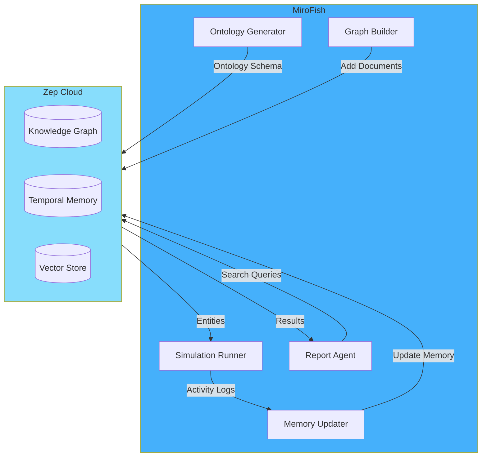

## What is Zep?

**Zep** is a long-term memory service for LLM applications, providing:

- **GraphRAG**: Knowledge graph construction and semantic search
- **Temporal Memory**: Time-aware memory storage with edge timestamps
- **Semantic Search**: Vector-based similarity search across memories
- **Entity Extraction**: Automatic entity and relationship extraction from text

<Card title="Zep Cloud" icon="brain" href="https://www.getzep.com/" horizontal>
  Learn more about Zep's memory platform and sign up for a free account
</Card>

## Why Zep?

MiroFish chose Zep for memory management because it provides:

<CardGroup cols={2}>
  <Card title="Persistent Graphs" icon="diagram-project">
    Store and query knowledge graphs across simulation sessions
  </Card>
  <Card title="Temporal Edges" icon="clock">
    Track how relationships evolve over time
  </Card>
  <Card title="Semantic Search" icon="magnifying-glass">
    Find relevant memories using natural language queries
  </Card>
  <Card title="Auto-Extraction" icon="wand-magic-sparkles">
    Automatically extract entities and relationships from text
  </Card>
</CardGroup>

## Integration Architecture



## How MiroFish Uses Zep

### 1. Knowledge Graph Construction

**Phase**: Graph Building

**Service**: `graph_builder.py`

**Process:**

<Steps>
  <Step title="Create Graph">
    Initialize a new Zep knowledge graph with custom ontology:
    
    ```python
    from zep_cloud.client import Zep
    
    zep = Zep(api_key=zep_api_key)
    
    graph = zep.graph.add(
        name="MiroFish Simulation Graph",
        description="Knowledge graph for public opinion prediction"
    )
    
    graph_id = graph.uuid
    ```
  </Step>
  
  <Step title="Define Ontology">
    Set entity types and relationship types:
    
    ```python
    ontology = {
        "node_types": [
            {"name": "Person"},
            {"name": "Organization"},
            {"name": "Event"},
            {"name": "Topic"}
        ],
        "edge_types": [
            {"name": "PARTICIPATES_IN"},
            {"name": "WORKS_FOR"},
            {"name": "DISCUSSES"}
        ]
    }
    
    zep.graph.update_ontology(
        graph_id=graph_id,
        ontology=ontology
    )
    ```
  </Step>
  
  <Step title="Add Documents">
    Upload seed documents for graph construction:
    
    ```python
    # Chunk documents
    chunks = text_processor.chunk_text(
        text=document_text,
        chunk_size=1000,
        chunk_overlap=200
    )
    
    # Add to Zep
    for chunk in chunks:
        zep.memory.add(
            graph_id=graph_id,
            messages=[{
                "role": "user",
                "content": chunk
            }]
        )
    ```
  </Step>
  
  <Step title="Extract Entities">
    Zep automatically extracts entities and relationships:
    
    ```python
    # Wait for processing
    import time
    time.sleep(10)
    
    # Query extracted entities
    entities = zep.graph.search(
        graph_id=graph_id,
        query="",
        search_type="entity"
    )
    ```
  </Step>
</Steps>

### 2. Entity Retrieval

**Phase**: Simulation Setup

**Service**: `zep_entity_reader.py`

Filter and enrich entities for agent generation:

```python
from zep_cloud.client import Zep

zep = Zep(api_key=zep_api_key)

# Get all entities of type "Person"
people = zep.graph.search(
    graph_id=graph_id,
    query="",
    search_type="entity",
    filters={"node_type": "Person"}
)

for person in people:
    print(f"Name: {person.name}")
    print(f"Properties: {person.properties}")
    print(f"Edges: {person.edges}")
```

**Enrichment with Edges:**

```python
# Get person with relationships
person = zep.graph.get_node(
    graph_id=graph_id,
    node_uuid=person_uuid
)

# Find related entities
for edge in person.edges:
    related_node = zep.graph.get_node(
        graph_id=graph_id,
        node_uuid=edge.target_uuid
    )
    print(f"Relationship: {edge.type} -> {related_node.name}")
```

### 3. Temporal Memory Updates

**Phase**: During Simulation

**Service**: `zep_graph_memory_updater.py`

Update graph with simulation activities:

**Batching Strategy:**

```python
# Batch activities from OASIS
activities = [
    {"round": 12, "agent": "Alice", "action": "CREATE_POST", "content": "..."},
    {"round": 12, "agent": "Bob", "action": "COMMENT", "content": "..."}
]

# Convert to natural language
batch_text = format_activities_as_text(activities)

# Add to Zep graph
zep.memory.add(
    graph_id=graph_id,
    messages=[{
        "role": "user",
        "content": batch_text,
        "metadata": {
            "round": 12,
            "timestamp": "2024-03-14T10:30:00Z"
        }
    }]
)
```

**Temporal Edges:**

Zep automatically adds timestamps to extracted edges:

```json
{
  "source": "Alice",
  "target": "Bob",
  "type": "REPLIED_TO",
  "timestamp": "2024-03-14T10:30:00Z",
  "properties": {
    "round": 12,
    "sentiment": "positive"
  }
}
```

Query temporal evolution:

```python
# Get edges created after round 10
edges = zep.graph.search(
    graph_id=graph_id,
    search_type="edge",
    filters={
        "timestamp_after": "2024-03-14T10:00:00Z"
    }
)
```

### 4. Memory Search for Reports

**Phase**: Report Generation

**Service**: `report_agent.py` (via `zep_tools.py`)

Report Agent uses Zep tools to query memory:

**Search Tool:**

```python
from langchain.tools import Tool

def search_memory(query: str) -> str:
    """
    Search Zep knowledge graph for relevant information.
    
    Args:
        query: Natural language search query
        
    Returns:
        Formatted search results
    """
    results = zep.graph.search(
        graph_id=graph_id,
        query=query,
        search_type="hybrid",  # Semantic + entity search
        limit=10
    )
    
    return format_search_results(results)

search_tool = Tool(
    name="SearchTool",
    description="Search the knowledge graph for information",
    func=search_memory
)
```

**InsightForge Tool:**

```python
def extract_insights(entity_name: str) -> str:
    """
    Get detailed information about a specific entity.
    
    Args:
        entity_name: Name of the entity to analyze
        
    Returns:
        Entity details and relationships
    """
    # Find entity
    entities = zep.graph.search(
        graph_id=graph_id,
        query=entity_name,
        search_type="entity",
        limit=1
    )
    
    if not entities:
        return f"Entity '{entity_name}' not found."
    
    entity = entities[0]
    
    # Get full node with edges
    node = zep.graph.get_node(
        graph_id=graph_id,
        node_uuid=entity.uuid
    )
    
    return format_entity_details(node)

insightforge_tool = Tool(
    name="InsightForgeTool",
    description="Get detailed insights about a specific entity",
    func=extract_insights
)
```

**Example ReportAgent Query:**

```python
# ReportAgent reasoning
agent_response = report_agent.invoke({
    "input": "Summarize Alice Johnson's opinions on the new policy"
})

# Agent uses SearchTool internally:
# 1. Thought: "I need to find Alice Johnson's posts about the policy"
# 2. Action: SearchTool("Alice Johnson policy opinions")
# 3. Observation: [search results]
# 4. Answer: "Alice expressed support for the policy, citing..."
```

## Zep API Examples

### Create a Graph

```python
from zep_cloud.client import Zep

zep = Zep(api_key="your-api-key")

graph = zep.graph.add(
    name="My Knowledge Graph",
    description="Description of the graph"
)

print(f"Graph ID: {graph.uuid}")
```

### Add Memory

```python
zep.memory.add(
    graph_id=graph.uuid,
    messages=[
        {"role": "user", "content": "Alice works for OpenAI."},
        {"role": "user", "content": "Bob is a researcher at Stanford."}
    ]
)
```

### Search Entities

```python
# Semantic search
results = zep.graph.search(
    graph_id=graph.uuid,
    query="Who works at OpenAI?",
    search_type="hybrid",
    limit=5
)

for result in results:
    print(f"Entity: {result.name}")
    print(f"Type: {result.node_type}")
    print(f"Properties: {result.properties}")
```

### Get Node Details

```python
node = zep.graph.get_node(
    graph_id=graph.uuid,
    node_uuid=node_uuid
)

print(f"Name: {node.name}")
print(f"Type: {node.node_type}")
print(f"Properties: {node.properties}")
print(f"Edges: {len(node.edges)}")
```

### Update Ontology

```python
ontology = {
    "node_types": [
        {"name": "Person"},
        {"name": "Organization"}
    ],
    "edge_types": [
        {"name": "WORKS_FOR"},
        {"name": "COLLABORATES_WITH"}
    ]
}

zep.graph.update_ontology(
    graph_id=graph.uuid,
    ontology=ontology
)
```

### Delete a Graph

```python
zep.graph.delete(graph_id=graph.uuid)
```

## Best Practices

<AccordionGroup>
  <Accordion title="Ontology Design">
    **Define entity types carefully:**
    
    - Use specific types ("Student", "Professor") instead of generic ("Person")
    - Include domain-relevant types ("Policy", "Regulation" for policy testing)
    - Balance specificity vs. generality
    
    **Edge types should capture key relationships:**
    
    - "SUPPORTS", "OPPOSES" for opinion analysis
    - "INVESTS_IN", "TRADES" for financial predictions
  </Accordion>
  
  <Accordion title="Chunking Strategy">
    **Optimal chunk sizes:**
    
    - **Default**: 1000 characters, 200 overlap
    - **Long documents**: Increase to 1500-2000
    - **Short posts**: Decrease to 500
    
    **Why chunking matters:**
    
    - Too large: Poor entity extraction, slow search
    - Too small: Loss of context, fragmented entities
  </Accordion>
  
  <Accordion title="Memory Batching">
    **Batch updates during simulation:**
    
    - Update every 5 rounds (not every round)
    - Batch 10-20 activities per update
    - Reduces API calls and improves performance
    
    **Example:**
    ```python
    if current_round % 5 == 0:
        activities = collect_activities_since_last_update()
        batch_text = format_batch(activities)
        zep.memory.add(graph_id, [{"role": "user", "content": batch_text}])
    ```
  </Accordion>
  
  <Accordion title="Search Optimization">
    **Use appropriate search types:**
    
    - **Semantic**: Natural language queries ("What are people saying about X?")
    - **Entity**: Find specific entities by name
    - **Hybrid**: Combine semantic + entity (recommended)
    
    **Limit results:**
    ```python
    results = zep.graph.search(
        graph_id=graph_id,
        query=query,
        search_type="hybrid",
        limit=20  # Don't retrieve too many
    )
    ```
  </Accordion>
</AccordionGroup>

## Limitations and Considerations

<Warning>
**Zep Cloud Free Tier Limits:**
</Warning>

- **Storage**: Limited graph size
- **API Calls**: Rate limits apply
- **Retention**: Memory retention policies

For production use, consider upgrading to a paid plan.

**Performance Considerations:**

- Entity extraction takes time (5-10 seconds per chunk)
- Large graphs (>10,000 nodes) may have slower search
- Temporal queries can be expensive

## Troubleshooting

<AccordionGroup>
  <Accordion title="Graph Build Fails">
    **Check:**
    
    1. Valid Zep API key in `.env`
    2. Network connectivity to Zep Cloud
    3. Document size (try smaller chunks)
    4. Zep quota limits
    
    **Debug:**
    ```bash
    # Test Zep connection
    curl https://api.getzep.com/api/v2/health \
      -H "Authorization: Bearer YOUR_API_KEY"
    ```
  </Accordion>
  
  <Accordion title="No Entities Extracted">
    **Possible causes:**
    
    - Document lacks clear entities (add more structured text)
    - Ontology too specific (use broader entity types)
    - Processing not complete (wait 30 seconds and retry)
    
    **Solution:**
    ```python
    import time
    
    # Add memory
    zep.memory.add(graph_id, messages)
    
    # Wait for extraction
    time.sleep(30)
    
    # Query entities
    entities = zep.graph.search(graph_id, query="", search_type="entity")
    ```
  </Accordion>
  
  <Accordion title="Search Returns Irrelevant Results">
    **Improve search quality:**
    
    - Use more specific queries
    - Add filters (node type, timestamp)
    - Increase chunk overlap for better context
    
    **Example:**
    ```python
    results = zep.graph.search(
        graph_id=graph_id,
        query="Alice's opinion on climate policy",
        search_type="hybrid",
        filters={
            "node_type": "Person",
            "timestamp_after": "2024-03-14T00:00:00Z"
        }
    )
    ```
  </Accordion>
</AccordionGroup>

---

<Card title="Zep Documentation" icon="book" href="https://help.getzep.com/">
  Explore the official Zep Cloud documentation for advanced features
</Card>
