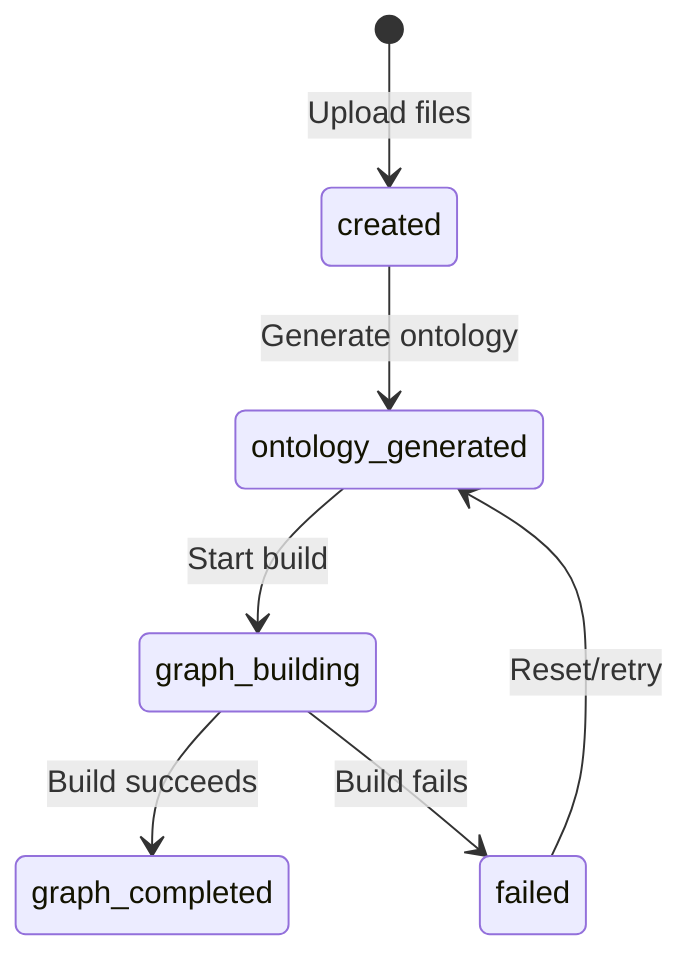

## Introduction

The Graph API provides a complete workflow for transforming unstructured documents into structured knowledge graphs. It leverages LLM-powered analysis to extract entities, relationships, and build queryable graph structures using the Zep platform.

## Core Workflow

The Graph API follows a two-phase process:

<Steps>
  <Step title="Generate Ontology">
    Upload documents (PDF, Markdown, TXT) along with simulation requirements. The API analyzes your content and generates a custom ontology defining entity types and relationship types specific to your domain.
    
    **Endpoint:** `POST /api/graph/ontology/generate`
  </Step>
  
  <Step title="Build Graph">
    Using the generated ontology and project ID, construct the actual knowledge graph. The API chunks your documents, extracts entities and relationships, and builds a graph structure in Zep.
    
    **Endpoint:** `POST /api/graph/build`
  </Step>
</Steps>

## Key Concepts

### Projects

Projects are the central organizing unit in the Graph API. Each project maintains:

- Uploaded document files
- Extracted text content
- Generated ontology (entity and edge types)
- Graph build configuration and status
- Reference to the built graph in Zep

**Project Lifecycle:**



### Ontology

The ontology defines the schema for your knowledge graph:

- **Entity Types**: Categories of nodes (e.g., "Person", "Organization", "Concept")
- **Edge Types**: Types of relationships between entities (e.g., "works_for", "related_to")
- **Analysis Summary**: Context about why the ontology was structured this way

### Tasks

Graph building is asynchronous and can take several minutes. The API provides task tracking to monitor progress:

- Real-time progress updates (0-100%)
- Detailed status messages
- Error reporting if build fails

## API Endpoints

<CardGroup cols={2}>
  <Card title="Project Management" icon="folder" href="/api/graph/projects">
    Create, retrieve, list, and delete projects
  </Card>
  
  <Card title="Ontology Generation" icon="brain" href="/api/graph/ontology">
    Upload documents and generate domain ontology
  </Card>
  
  <Card title="Graph Building" icon="diagram-project" href="/api/graph/build-graph">
    Construct knowledge graphs from projects
  </Card>
</CardGroup>

## Authentication

The Graph API requires proper configuration of:

- **LLM Provider**: Set `OPENAI_API_KEY` or equivalent for ontology generation
- **Zep API Key**: Set `ZEP_API_KEY` for graph storage and construction

<Warning>
  Missing API keys will result in 500 errors with configuration error messages.
</Warning>

## Rate Limits and Considerations

- Document processing time depends on file size and LLM response times
- Graph building is CPU and API-intensive; expect 2-10 minutes for typical documents
- Large documents are automatically chunked (default: 500 characters with 50 character overlap)
- Projects persist server-side to avoid passing large payloads between requests

## Error Handling

All endpoints return JSON responses with a standard structure:

```json
{
  "success": true|false,
  "data": { ... },      // On success
  "error": "...",      // On failure
  "traceback": "..."   // Detailed error for debugging
}
```

HTTP status codes:
- `200`: Success
- `400`: Bad request (missing parameters, invalid state)
- `404`: Resource not found (project, task, graph)
- `500`: Server error (configuration issues, processing failures)
