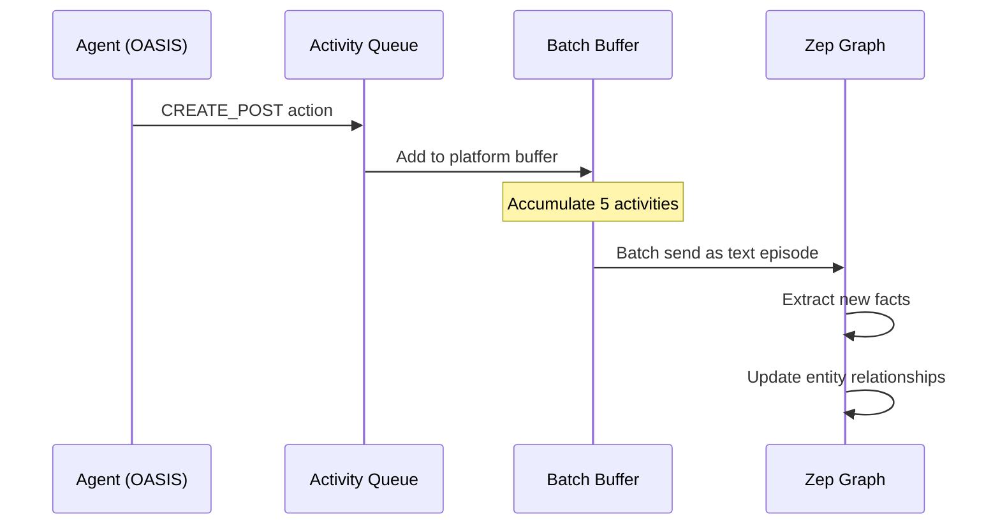

# Knowledge Graph & GraphRAG

MiroFish uses **GraphRAG** (Graph-based Retrieval-Augmented Generation) powered by Zep Cloud to transform unstructured documents into structured knowledge networks. This foundation enables realistic social simulation by modeling entities, relationships, and temporal dynamics.

## What is GraphRAG?

**Traditional RAG**: Retrieve relevant text chunks → Feed to LLM

**GraphRAG**: Extract entities and relationships → Build knowledge graph → Query structured knowledge

### Why GraphRAG for Social Simulation?

<CardGroup cols={2}>

<Card title="Relationship-Aware" icon="network-wired">
Understand "who knows who" and "who influences whom" - critical for modeling social dynamics
</Card>

<Card title="Temporal Tracking" icon="clock">
Track how relationships evolve over time during simulation
</Card>

<Card title="Multi-Hop Reasoning" icon="route">
Answer questions like "How is Entity A connected to Entity C through Entity B?"
</Card>

<Card title="Fact Grounding" icon="anchor">
Every simulation behavior traces back to original document facts
</Card>

</CardGroup>

---

## Ontology Design

The ontology defines **what types of entities exist** and **how they can relate**. MiroFish uses LLM to auto-generate custom ontologies from document analysis.

### Design Principles

**Service**: `ontology_generator.py:1-454`

**Key Rule**: Entities must be **social media actors** - entities that can post, comment, and interact.

<Tabs>
  <Tab title="Valid Entities">
    **People**:
    - Students, professors, journalists, officials
    - Public figures, experts, activists
    - Generic "Person" (fallback)

    **Organizations**:
    - Universities, companies, government agencies
    - Media outlets, NGOs, hospitals
    - Generic "Organization" (fallback)

    **Platforms**:
    - Social media platforms themselves (Weibo, Twitter)
  </Tab>
  
  <Tab title="Invalid Entities">
    **Abstract Concepts**:
    - ❌ "Sentiment", "Emotion", "Public Opinion"
    - ❌ "Trend", "Movement", "Crisis"

    **Topics/Themes**:
    - ❌ "Academic Integrity", "Education Reform"
    - ❌ "Political Debate", "Economic Policy"

    **Positions/Stances**:
    - ❌ "Supporters", "Opponents"
    - ❌ "Conservatives", "Liberals"

    *Why invalid?* These cannot act autonomously on social media.
  </Tab>
</Tabs>

### Ontology Structure

**Required Components**:

1. **Entity Types** (exactly 10):
   - 8 specific types (domain-tailored)
   - 2 fallback types (Person, Organization)

2. **Edge Types** (6-10):
   - Relationship definitions with source/target constraints

3. **Attributes** (1-3 per type):
   - Avoid reserved names: `name`, `uuid`, `summary`, `created_at`, `group_id`
   - Use instead: `full_name`, `org_name`, `title`, `role`, `position`

**Example Ontology** (Academic Event):

```json
{
  "entity_types": [
    {
      "name": "Student",
      "description": "University student enrolled in degree programs",
      "attributes": [
        {"name": "major", "type": "text", "description": "Field of study"},
        {"name": "year", "type": "text", "description": "Academic year"}
      ],
      "examples": ["李明 (CS major)", "王芳 (Biology student)"]
    },
    {
      "name": "Professor",
      "description": "Academic faculty member",
      "attributes": [
        {"name": "department", "type": "text", "description": "Academic department"},
        {"name": "title", "type": "text", "description": "Academic rank"}
      ]
    },
    {
      "name": "University",
      "description": "Higher education institution",
      "attributes": [
        {"name": "location", "type": "text", "description": "City/region"},
        {"name": "type", "type": "text", "description": "Public/private"}
      ]
    },
    {
      "name": "MediaOutlet",
      "description": "News organization or publication",
      "attributes": [
        {"name": "media_type", "type": "text", "description": "TV/newspaper/online"}
      ]
    },
    // ... 4 more specific types ...
    {
      "name": "Person",
      "description": "Any individual not fitting specific person types",
      "attributes": [
        {"name": "full_name", "type": "text"},
        {"name": "role", "type": "text"}
      ]
    },
    {
      "name": "Organization",
      "description": "Any organization not fitting specific org types",
      "attributes": [
        {"name": "org_name", "type": "text"},
        {"name": "org_type", "type": "text"}
      ]
    }
  ],
  "edge_types": [
    {
      "name": "STUDIES_AT",
      "description": "Student enrolled at university",
      "source_targets": [{"source": "Student", "target": "University"}]
    },
    {
      "name": "WORKS_FOR",
      "description": "Employment relationship",
      "source_targets": [
        {"source": "Professor", "target": "University"},
        {"source": "Person", "target": "Organization"}
      ]
    },
    {
      "name": "REPORTS_ON",
      "description": "Media coverage of entity/event",
      "source_targets": [
        {"source": "MediaOutlet", "target": "Person"},
        {"source": "MediaOutlet", "target": "Organization"}
      ]
    },
    {
      "name": "RESPONDS_TO",
      "description": "Public response or statement",
      "source_targets": [
        {"source": "Person", "target": "Person"},
        {"source": "Organization", "target": "Person"}
      ]
    }
  ]
}
```

<Info>
  **Fallback Types**: When Zep extracts "某位网友" (some netizen) or "小型组织" (small group), they're classified as `Person` or `Organization` since no specific type matches.
</Info>

---

## Graph Construction Process

**Service**: `graph_builder.py:1-501`

<Steps>

### 1. Create Graph
**Method**: `create_graph(name: str) -> str`

Generate unique graph ID and register with Zep:
```python
graph_id = f"mirofish_{uuid.uuid4().hex[:16]}"
client.graph.create(
    graph_id=graph_id,
    name=name,
    description="MiroFish Social Simulation Graph"
)
```

### 2. Set Ontology
**Method**: `set_ontology(graph_id: str, ontology: Dict)`

Dynamically create Pydantic models from ontology JSON:

```python
# Example: Create Student entity class
class Student(EntityModel):
    """University student enrolled in degree programs"""
    major: Optional[EntityText] = Field(description="Field of study", default=None)
    year: Optional[EntityText] = Field(description="Academic year", default=None)

# Register with Zep
client.graph.set_ontology(
    graph_ids=[graph_id],
    entities={"Student": Student, "Professor": Professor, ...},
    edges=edge_definitions
)
```

**Reference**: `graph_builder.py:199-286`

### 3. Text Chunking
**Service**: `text_processor.py`

Split document into overlapping chunks:
- **Chunk size**: 500 tokens (configurable)
- **Overlap**: 50 tokens (preserves context across boundaries)
- **Algorithm**: Sentence-aware splitting (doesn't break mid-sentence)

**Why chunk?** LLM entity extraction works best on focused text segments. Overlap ensures entities mentioned across chunk boundaries aren't missed.

### 4. Batch Upload
**Method**: `add_text_batches(graph_id, chunks, batch_size=3)`

Send chunks to Zep in batches:

```python
for i in range(0, len(chunks), batch_size):
    batch_chunks = chunks[i:i + batch_size]
    episodes = [
        EpisodeData(data=chunk, type="text") 
        for chunk in batch_chunks
    ]
    batch_result = client.graph.add_batch(
        graph_id=graph_id, 
        episodes=episodes
    )
    # Collect episode UUIDs for status tracking
    episode_uuids.extend([ep.uuid_ for ep in batch_result])
    time.sleep(1)  # Rate limiting
```

**Reference**: `graph_builder.py:288-339`

<Note>
  **Asynchronous Processing**: Zep processes episodes in background. MiroFish polls `episode.processed` status until all complete.
</Note>

### 5. Wait for Processing
**Method**: `_wait_for_episodes(episode_uuids)`

Poll each episode until `processed=True`:

```python
pending_episodes = set(episode_uuids)
while pending_episodes:
    for ep_uuid in list(pending_episodes):
        episode = client.graph.episode.get(uuid_=ep_uuid)
        if episode.processed:
            pending_episodes.remove(ep_uuid)
            completed_count += 1
    time.sleep(3)  # Check every 3 seconds
```

**Timeout**: 600 seconds (10 minutes) default

**Reference**: `graph_builder.py:341-395`

### 6. Fetch Graph Data
**Method**: `get_graph_data(graph_id) -> Dict`

Retrieve complete graph with details:

```python
nodes = fetch_all_nodes(client, graph_id)  # Handles pagination
edges = fetch_all_edges(client, graph_id)

# Format node data
for node in nodes:
    nodes_data.append({
        "uuid": node.uuid_,
        "name": node.name,
        "labels": node.labels,  # ["Student", "Entity"]
        "summary": node.summary,
        "attributes": node.attributes,  # {"major": "CS", "year": "3"}
        "created_at": node.created_at
    })

# Format edge data with temporal info
for edge in edges:
    edges_data.append({
        "uuid": edge.uuid_,
        "fact": edge.fact,  # "李明 studies at 武汉大学"
        "fact_type": edge.name,  # "STUDIES_AT"
        "source_node_uuid": edge.source_node_uuid,
        "target_node_uuid": edge.target_node_uuid,
        "valid_at": edge.valid_at,  # When relationship started
        "invalid_at": edge.invalid_at,  # When it ended (optional)
        "episodes": edge.episodes  # Source chunks
    })
```

**Reference**: `graph_builder.py:420-495`

</Steps>

---

## Graph Data Structure

### Nodes (Entities)

Each node represents a social actor:

```json
{
  "uuid": "550e8400-e29b-41d4-a716-446655440000",
  "name": "李明",
  "labels": ["Student", "Entity"],
  "summary": "武汉大学计算机系大三学生,关注学术诚信问题",
  "attributes": {
    "major": "Computer Science",
    "year": "Junior"
  },
  "created_at": "2024-03-15T10:30:00Z"
}
```

**Key Fields**:
- **uuid**: Unique identifier
- **name**: Primary name (used for agent username)
- **labels**: Entity types (most specific label used for filtering)
- **summary**: LLM-generated description from source text
- **attributes**: Custom fields from ontology

### Edges (Relationships)

Edges represent facts extracted from text:

```json
{
  "uuid": "660e8400-e29b-41d4-a716-446655440001",
  "fact": "李明就读于武汉大学计算机系",
  "fact_type": "STUDIES_AT",
  "source_node_uuid": "550e8400-e29b-41d4-a716-446655440000",
  "target_node_uuid": "770e8400-e29b-41d4-a716-446655440002",
  "source_node_name": "李明",
  "target_node_name": "武汉大学",
  "valid_at": "2022-09-01T00:00:00Z",
  "invalid_at": null,
  "episodes": ["episode_uuid_1", "episode_uuid_2"],
  "attributes": {}
}
```

**Key Fields**:
- **fact**: Natural language description (Zep extracts this)
- **fact_type**: Relationship type from ontology
- **valid_at / invalid_at**: Temporal bounds (when relationship holds)
- **episodes**: Links back to source text chunks

<Info>
  **Temporal Edges**: During simulation, when agents interact, new edges are created with timestamps. This allows querying "What was the relationship at time T?"
</Info>

---

## Entity Filtering & Enrichment

**Service**: `zep_entity_reader.py:1-220`

Before simulation, entities are filtered and enriched:

<Steps>

### Fetch All Nodes
**Method**: `fetch_all_nodes(client, graph_id)`

Handle Zep's pagination (100 nodes per page):
```python
def fetch_all_nodes(client, graph_id):
    all_nodes = []
    cursor = None
    while True:
        response = client.graph.search(
            graph_id=graph_id,
            scope="nodes",
            limit=100,
            cursor=cursor
        )
        all_nodes.extend(response.nodes)
        if not response.has_more:
            break
        cursor = response.cursor
    return all_nodes
```

### Filter by Type
**Method**: `filter_defined_entities(graph_id, defined_entity_types)`

Keep only entities matching ontology types:
```python
for node in all_nodes:
    # Extract most specific label (skip "Entity", "Node")
    entity_type = [l for l in node.labels if l not in ["Entity", "Node"]][0]
    
    if entity_type in defined_entity_types:
        filtered_entities.append(node)
```

**Why filter?** Zep may extract extra entities not in ontology (e.g., "Event", "Location"). Only ontology entities become agents.

### Enrich with Relationships
**Method**: `_enrich_entity_with_edges(entity, graph_id)`

For each entity, fetch connected edges and nodes:

```python
def _enrich_entity_with_edges(entity):
    # Search edges where entity is source or target
    edge_search = client.graph.search(
        graph_id=graph_id,
        query=entity.name,
        scope="edges",
        limit=50
    )
    
    for edge in edge_search.edges:
        # Add edge info
        entity.related_edges.append({
            "edge_name": edge.name,
            "fact": edge.fact,
            "direction": "outgoing" if edge.source_node_uuid == entity.uuid else "incoming"
        })
        
        # Fetch connected node details
        other_node_uuid = edge.target_node_uuid if direction == "outgoing" else edge.source_node_uuid
        other_node = client.graph.node.get(uuid_=other_node_uuid)
        entity.related_nodes.append({
            "name": other_node.name,
            "labels": other_node.labels,
            "summary": other_node.summary
        })
```

**Purpose**: Enriched entities provide context for persona generation.

</Steps>

**Output Example**:

```python
EntityNode(
    uuid="550e8400...",
    name="李明",
    labels=["Student"],
    summary="武汉大学计算机系大三学生...",
    attributes={"major": "CS", "year": "3"},
    related_edges=[
        {"edge_name": "STUDIES_AT", "fact": "李明就读于武汉大学", "direction": "outgoing"},
        {"edge_name": "FRIENDS_WITH", "fact": "李明与王芳是同学", "direction": "outgoing"}
    ],
    related_nodes=[
        {"name": "武汉大学", "labels": ["University"], "summary": "中国知名高校..."},
        {"name": "王芳", "labels": ["Student"], "summary": "生物系学生..."}
    ]
)
```

---

## GraphRAG Query Examples

### Semantic Search

Find facts related to a topic:

```python
result = client.graph.search(
    graph_id=graph_id,
    query="学术诚信 学生观点",
    scope="edges",
    limit=20
)

# Returns edges with relevant facts:
# - "李明认为学术不端应严肃处理"
# - "王芳质疑学校调查程序"
# - "张教授呼吁建立长效机制"
```

### Entity Search

Find entities matching description:

```python
result = client.graph.search(
    graph_id=graph_id,
    query="计算机系教授",
    scope="nodes",
    limit=10
)

# Returns nodes:
# - "张教授" (Professor, CS department)
# - "李副教授" (Professor, AI lab)
```

### Hybrid Search

Combine node and edge search:

```python
# Parallel search
import concurrent.futures

with ThreadPoolExecutor(max_workers=2) as executor:
    edge_future = executor.submit(
        client.graph.search, graph_id=graph_id, query=query, scope="edges"
    )
    node_future = executor.submit(
        client.graph.search, graph_id=graph_id, query=query, scope="nodes"
    )
    
    edge_result = edge_future.result()
    node_result = node_future.result()

# Combine results for comprehensive context
```

**Used in**: `oasis_profile_generator.py:286-411` for persona enrichment

---

## Graph Updates During Simulation

As agents act in simulation, their activities update the graph:

**Service**: `zep_graph_memory_updater.py:1-549`

### Activity → Graph Update Flow



### Example Updates

**Original Graph**:
```
李明 --[STUDIES_AT]--> 武汉大学
```

**After Simulation Round 5**:
```
李明 --[STUDIES_AT]--> 武汉大学
李明 --[POSTED_ABOUT]--> 学术诚信话题 (valid_at: 2024-03-15T14:32)
李明 --[INTERACTED_WITH]--> 王芳 (valid_at: 2024-03-15T15:10)
```

**Activity Text Sent to Zep**:
```
li_ming_837: 发布了一条帖子：「作为计算机专业学生,我认为学术诚信是科研的底线。任何形式的造假都应严肃处理。」

wang_fang_421: 点赞了李明的帖子：「作为计算机专业学生,我认为学术诚信是科研的底线...」
```

Zep automatically:
1. Identifies entities ("李明", "王芳")
2. Extracts new facts ("李明发表了关于学术诚信的观点")
3. Creates/updates edges with timestamps

<Note>
  **Incremental Learning**: The graph evolves with simulation, capturing emergent relationships and new facts not in original documents.
</Note>

---

## Best Practices

<AccordionGroup>

<Accordion title="Ontology Design">
**Do**:
- Let LLM generate ontology from documents (it knows the content)
- Include both specific types (Student, Professor) and fallback types (Person)
- Use clear, non-overlapping entity type descriptions
- Test with sample text to ensure good entity extraction

**Don't**:
- Create too many entity types (max 10 due to Zep limit)
- Use abstract concepts as entity types
- Overlap entity type definitions ("Student" vs "UniversityStudent")
- Forget fallback types (Person, Organization)
</Accordion>

<Accordion title="Text Chunking">
**Optimal settings**:
- **Chunk size**: 500-1000 tokens (balance context vs specificity)
- **Overlap**: 50-100 tokens (10-20% of chunk size)
- **Batch size**: 3-5 chunks per Zep API call

**Why?**
- Too small chunks: Miss context, fragment entities
- Too large chunks: Dilute signal, slow processing
- Overlap: Ensures entities mentioned across boundaries are captured
</Accordion>

<Accordion title="Graph Maintenance">
**During development**:
- Delete test graphs regularly (they persist in Zep Cloud)
- Monitor graph size (nodes + edges) for performance
- Check episode processing times

**In production**:
- Archive graphs after simulation complete
- Implement graph versioning for re-runs
- Set up monitoring for Zep API limits
</Accordion>

</AccordionGroup>

## Next Steps

<CardGroup cols={2}>

<Card title="Multi-Agent Simulation" icon="users" href="/concepts/multi-agent-simulation">
Learn how graph entities become autonomous agents
</Card>

<Card title="Memory System" icon="database" href="/concepts/memory-system">
Understand temporal memory updates during simulation
</Card>

</CardGroup>