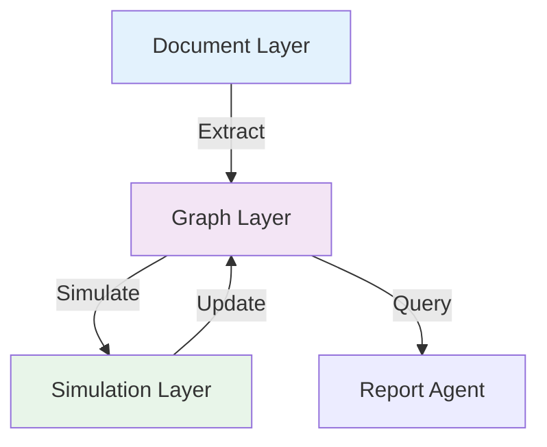
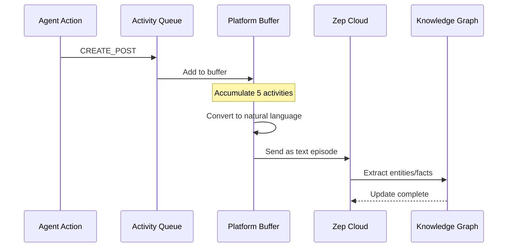

# Memory System

MiroFish uses **Zep Cloud** as its memory layer, providing temporal knowledge graphs and long-term memory capabilities. This enables the system to track how knowledge evolves during simulation and answer time-aware questions.

## Why Zep Cloud?

**Zep** is a long-term memory platform designed for AI applications, with specialized features for knowledge graphs:

<CardGroup cols={2}>

<Card title="GraphRAG" icon="network-wired">
Automatic entity/relationship extraction from text with LLM-powered understanding
</Card>

<Card title="Temporal Edges" icon="clock">
Track when relationships started, changed, or ended
</Card>

<Card title="Semantic Search" icon="magnifying-glass">
Vector + keyword hybrid search across facts and entities
</Card>

<Card title="Incremental Updates" icon="arrow-up">
Add new facts without rebuilding entire graph
</Card>

</CardGroup>

**Official Docs**: [https://help.getzep.com/](https://help.getzep.com/)

---

## Memory Architecture

### Three-Layer Model



**1. Document Layer** (Static)
- Original seed documents chunked as "episodes"
- Zep extracts initial entities/relationships
- Never modified after construction

**2. Graph Layer** (Dynamic)
- Nodes: Entities with summaries and attributes
- Edges: Relationships with temporal bounds
- Updated continuously during simulation

**3. Simulation Layer** (Temporal)
- Agent activities as time-stamped events
- Batched and converted to natural language
- Fed back to graph layer as new episodes

---

## Graph Construction

### Episodes

Zep organizes input text into **episodes** - discrete chunks that get processed:

```python
# Send text chunk to Zep
episode_data = EpisodeData(
    data="李明是武汉大学计算机系的大三学生,他最近发表了一篇关于AI伦理的文章...",
    type="text"
)

result = client.graph.add(
    graph_id=graph_id,
    episodes=[episode_data]
)

episode_uuid = result[0].uuid_
```

**What Zep does**:
1. Chunk text into sentences
2. Extract entities ("李明", "武汉大学", "AI伦理")
3. Classify entity types using ontology ("Student", "University", "Topic")
4. Extract relationships ("李明" STUDIES_AT "武汉大学")
5. Generate entity summaries
6. Create/update graph nodes and edges

**Processing Status**:
```python
episode = client.graph.episode.get(uuid_=episode_uuid)
if episode.processed:
    print("Episode processed, entities extracted")
```

**Reference**: `graph_builder.py:311-339`

### Ontology Definition

Ontology constrains what entities/relationships Zep extracts:

```python
from zep_cloud.external_clients.ontology import EntityModel, EdgeModel, EntityText
from pydantic import Field

# Define entity type
class Student(EntityModel):
    """University student enrolled in degree programs"""
    major: Optional[EntityText] = Field(description="Field of study", default=None)
    year: Optional[EntityText] = Field(description="Academic year", default=None)

# Define relationship type
class StudiesAt(EdgeModel):
    """Student enrolled at university"""
    pass

# Set ontology
client.graph.set_ontology(
    graph_ids=[graph_id],
    entities={
        "Student": Student,
        "Professor": Professor,
        "University": University,
        ...
    },
    edges={
        "STUDIES_AT": (StudiesAt, [
            EntityEdgeSourceTarget(source="Student", target="University")
        ]),
        ...
    }
)
```

**Reference**: `graph_builder.py:199-286`

<Info>
  **Ontology = Schema**: Just like SQL tables need schemas, Zep graphs need ontologies. This ensures extracted entities match your domain model.
</Info>

---

## Temporal Memory

### Edge Timestamps

Every edge (relationship) has temporal metadata:

```python
class GraphEdge:
    uuid_: str
    fact: str  # "李明就读于武汉大学计算机系"
    name: str  # "STUDIES_AT"
    source_node_uuid: str
    target_node_uuid: str
    
    # Temporal fields
    created_at: datetime  # When this edge was created in graph
    valid_at: datetime    # When this relationship started in real world
    invalid_at: Optional[datetime]  # When it ended (None if still valid)
    expired_at: Optional[datetime]  # When this edge version was superseded
    
    # Provenance
    episodes: List[str]  # Which episodes mentioned this relationship
```

**Example Timeline**:

```
t0: Graph created from documents
    李明 --[STUDIES_AT]--> 武汉大学 (valid_at=2021-09-01, invalid_at=None)

t1: Simulation Round 5
    李明 --[POSTED_ABOUT]--> 学术诚信 (valid_at=Round5_timestamp, invalid_at=None)

t2: Simulation Round 12
    李明 --[AGREED_WITH]--> 王芳 (valid_at=Round12_timestamp, invalid_at=None)
    (Based on LIKE_POST action)

t3: Simulation Round 20
    李明 --[OPPOSED]--> 校方处理方式 (valid_at=Round20_timestamp, invalid_at=None)
    (Based on critical post)
```

**Querying Temporal State**:

While Zep's API doesn't directly support temporal filtering, edges carry timestamps for post-filtering:

```python
# Get all edges
edges = fetch_all_edges(client, graph_id)

# Filter by time range
round_20_timestamp = datetime(...)
edges_at_round_20 = [
    edge for edge in edges
    if edge.valid_at <= round_20_timestamp
    and (edge.invalid_at is None or edge.invalid_at > round_20_timestamp)
]

# Now query: "What did 李明 think about 校方 at Round 20?"
relevant_edges = [e for e in edges_at_round_20 if "李明" in e.fact and "校方" in e.fact]
```

<Note>
  **Future Enhancement**: Zep may add native temporal query support. For now, MiroFish implements client-side filtering.
</Note>

---

## Simulation Memory Updates

**Service**: `zep_graph_memory_updater.py`

### Update Flow



### Batching Strategy

**Why batch?**
- Reduce API calls (Zep has rate limits)
- Group related activities for better context
- Separate platforms (Twitter vs Reddit have different dynamics)

**Implementation**:

```python
class ZepGraphMemoryUpdater:
    BATCH_SIZE = 5  # Activities per batch
    SEND_INTERVAL = 0.5  # Seconds between batches
    
    def __init__(self, graph_id: str):
        self.graph_id = graph_id
        self._activity_queue = Queue()
        # Separate buffers for each platform
        self._platform_buffers = {
            'twitter': [],
            'reddit': []
        }
    
    def add_activity(self, activity: AgentActivity):
        """Add activity to queue"""
        if activity.action_type == "DO_NOTHING":
            self._skipped_count += 1
            return  # Don't send DO_NOTHING to graph
        
        self._activity_queue.put(activity)
    
    def _worker_loop(self):
        """Background thread processes queue"""
        while self._running:
            activity = self._activity_queue.get(timeout=1)
            platform = activity.platform  # 'twitter' or 'reddit'
            
            # Add to platform buffer
            self._platform_buffers[platform].append(activity)
            
            # Send when buffer full
            if len(self._platform_buffers[platform]) >= BATCH_SIZE:
                batch = self._platform_buffers[platform][:BATCH_SIZE]
                self._send_batch_activities(batch, platform)
                self._platform_buffers[platform] = self._platform_buffers[platform][BATCH_SIZE:]
                time.sleep(SEND_INTERVAL)
```

**Reference**: `zep_graph_memory_updater.py:214-388`

### Activity Formatting

Activities are converted to natural language before sending to Zep:

```python
class AgentActivity:
    def to_episode_text(self) -> str:
        """Convert action to natural language for Zep"""
        # Format: "agent_name: 描述"
        if self.action_type == "CREATE_POST":
            content = self.action_args.get("content", "")
            return f"{self.agent_name}: 发布了一条帖子：「{content}」"
        
        elif self.action_type == "LIKE_POST":
            post_content = self.action_args.get("post_content", "")
            post_author = self.action_args.get("post_author_name", "")
            return f"{self.agent_name}: 点赞了{post_author}的帖子：「{post_content}」"
        
        elif self.action_type == "CREATE_COMMENT":
            content = self.action_args.get("content", "")
            post_author = self.action_args.get("post_author_name", "")
            return f"{self.agent_name}: 在{post_author}的帖子下评论道：「{content}」"
        
        elif self.action_type == "FOLLOW":
            target = self.action_args.get("target_user_name", "")
            return f"{self.agent_name}: 关注了用户「{target}」"
        
        # ... more action types ...
```

**Reference**: `zep_graph_memory_updater.py:34-198`

**Example Batch**:

```python
batch = [
    "li_ming_837: 发布了一条帖子：「学术诚信是科研的底线,必须零容忍」",
    "wang_fang_421: 点赞了李明的帖子：「学术诚信是科研的底线...」",
    "zhang_professor_012: 在李明的帖子下评论道：「赞同,学校应建立长效机制」",
    "media_outlet_5: 转发了李明的帖子：「学术诚信是科研的底线...」",
    "wuhan_university_official: 关注了用户「李明」"
]

# Combine into single text
combined_text = "\n".join(batch)

# Send to Zep
client.graph.add(
    graph_id=graph_id,
    type="text",
    data=combined_text
)
```

**What Zep extracts**:
- New facts: "李明发表了关于学术诚信的观点", "王芳认同李明的看法"
- New relationships: "王芳" AGREED_WITH "李明", "张教授" COMMENTED_ON "学术诚信话题"
- Updated entity summaries: "李明" summary now includes "关注学术诚信问题"

<Info>
  **Natural Language is Key**: Zep's LLM-based extraction works best with natural descriptions, not structured logs. That's why MiroFish converts `{"action": "LIKE_POST"}` to "点赞了...的帖子".
</Info>

---

## Memory Retrieval (Zep Tools)

**Service**: `zep_tools.py`

The Report Agent uses specialized tools to query the memory graph:

### Search Tool

Semantic search across facts:

```python
def search_graph(graph_id: str, query: str, limit: int = 20) -> SearchResult:
    """
    Search edges (facts) in the knowledge graph.
    
    Example:
        query = "学生对学术诚信的观点"
        Returns facts like:
        - "李明认为学术诚信是底线"
        - "王芳质疑学校调查过程"
    """
    result = client.graph.search(
        graph_id=graph_id,
        query=query,
        scope="edges",
        limit=limit,
        reranker="rrf"  # Reciprocal Rank Fusion
    )
    
    facts = []
    for edge in result.edges:
        facts.append({
            "fact": edge.fact,
            "source": edge.source_node_name,
            "target": edge.target_node_name,
            "type": edge.name,
            "valid_at": str(edge.valid_at) if edge.valid_at else None
        })
    
    return SearchResult(facts=facts, total=len(facts))
```

**Usage in Report**:
```
[Tool Call] search(query="学生群体 立场")
[Result] 15 facts:
1. 李明发表观点「学术诚信必须零容忍」
2. 王芳质疑「学校调查程序不透明」
3. ...

[Agent Reasoning] 根据这些事实,学生群体主要持批评态度...
```

**Reference**: `zep_tools.py:100-200`

### InsightForge Tool

Analyze patterns across entities/relationships:

```python
def insight_forge(graph_id: str, query: str) -> InsightForgeResult:
    """
    Generate insights from graph patterns.
    
    Example:
        query = "分析不同群体对事件的态度差异"
        Returns structured analysis of sentiment by entity type.
    """
    # Fetch relevant edges
    edges = client.graph.search(
        graph_id=graph_id,
        query=query,
        scope="edges",
        limit=100
    )
    
    # Group by entity type
    insights = {}
    for edge in edges:
        source_type = get_entity_type(edge.source_node_uuid)
        if source_type not in insights:
            insights[source_type] = {"facts": [], "sentiment": "neutral"}
        insights[source_type]["facts"].append(edge.fact)
    
    # Analyze sentiment per group
    for entity_type, data in insights.items():
        sentiment = analyze_sentiment(data["facts"])
        insights[entity_type]["sentiment"] = sentiment
    
    return InsightForgeResult(insights=insights)
```

**Usage in Report**:
```
[Tool Call] insight_forge(query="各方立场分析")
[Result] 
- Students: 负面情绪占70% (批评为主)
- Professors: 中性偏负 (呼吁改革)
- University: 正面姿态 (承诺整改)
- Media: 中性 (客观报道)

[Agent Reasoning] 可见学生群体反应最激烈,校方与学生立场存在分歧...
```

**Reference**: `zep_tools.py:300-450`

### Panorama Tool

High-level graph overview:

```python
def panorama(graph_id: str) -> PanoramaResult:
    """
    Get overview of entire graph state.
    
    Returns:
        - Total nodes/edges
        - Entity type distribution
        - Most connected entities
        - Recent activity summary
    """
    # Fetch all nodes (with pagination)
    nodes = fetch_all_nodes(client, graph_id)
    edges = fetch_all_edges(client, graph_id)
    
    # Count by type
    entity_types = {}
    for node in nodes:
        node_type = get_primary_label(node)
        entity_types[node_type] = entity_types.get(node_type, 0) + 1
    
    # Find hubs (highly connected entities)
    node_degrees = {}
    for edge in edges:
        node_degrees[edge.source_node_uuid] = node_degrees.get(edge.source_node_uuid, 0) + 1
        node_degrees[edge.target_node_uuid] = node_degrees.get(edge.target_node_uuid, 0) + 1
    
    top_nodes = sorted(node_degrees.items(), key=lambda x: x[1], reverse=True)[:10]
    
    # Recent edges (created in last simulation)
    recent_threshold = datetime.now() - timedelta(hours=1)
    recent_edges = [e for e in edges if e.created_at > recent_threshold]
    
    return PanoramaResult(
        total_nodes=len(nodes),
        total_edges=len(edges),
        entity_type_counts=entity_types,
        top_connected_entities=top_nodes,
        recent_activity_count=len(recent_edges)
    )
```

**Usage in Report**:
```
[Tool Call] panorama()
[Result]
- 总节点: 52 (Student: 18, Professor: 8, University: 3, Media: 5, ...)
- 总边: 487 (原始120 + 模拟新增367)
- 最活跃实体: 李明(45条边), 王芳(32条边), 武汉大学官方(28条边)
- 最近1小时新增: 87条关系

[Agent Reasoning] 模拟产生了大量新的社交互动,学生群体参与度最高...
```

**Reference**: `zep_tools.py:500-600`

### Interview Tool

Query specific entity:

```python
def interview_entity(graph_id: str, entity_name: str) -> InterviewResult:
    """
    Deep dive into a specific entity.
    
    Returns:
        - Entity details
        - All related facts
        - Timeline of activities
    """
    # Search for entity
    node_result = client.graph.search(
        graph_id=graph_id,
        query=entity_name,
        scope="nodes",
        limit=1
    )
    
    if not node_result.nodes:
        return InterviewResult(error=f"Entity '{entity_name}' not found")
    
    node = node_result.nodes[0]
    
    # Get all edges involving this entity
    edge_result = client.graph.search(
        graph_id=graph_id,
        query=entity_name,
        scope="edges",
        limit=100
    )
    
    # Build timeline
    timeline = []
    for edge in sorted(edge_result.edges, key=lambda e: e.valid_at or datetime.min):
        timeline.append({
            "time": str(edge.valid_at),
            "fact": edge.fact,
            "type": edge.name
        })
    
    return InterviewResult(
        entity={
            "name": node.name,
            "type": get_primary_label(node),
            "summary": node.summary,
            "attributes": node.attributes
        },
        timeline=timeline,
        total_facts=len(timeline)
    )
```

**Usage in Report**:
```
[Tool Call] interview_entity(entity_name="李明")
[Result]
姓名: 李明
类型: Student
摘要: 武汉大学计算机系大三学生,关注学术诚信和AI技术

时间线:
- 2021-09-01: 李明就读于武汉大学计算机系
- 2024-03-15 10:05: 李明发布了关于学术诚信的观点
- 2024-03-15 12:30: 李明与王芳进行了互动
- 2024-03-15 15:00: 李明批评了校方的处理方式
- ...

[Agent Reasoning] 李明是此次讨论中的活跃参与者,从其时间线看...
```

**Reference**: `zep_tools.py:650-750`

---

## Memory Management

### Graph Lifecycle

<Steps>

#### Creation
```python
graph_id = graph_builder.create_graph(name="MiroFish Simulation Graph")
# Graph persists in Zep Cloud
```

#### Active Use
```python
# During simulation: continuous updates
memory_updater.add_activity(activity)
# Graph grows with new facts
```

#### Archival
```python
# Export graph data for backup
graph_data = graph_builder.get_graph_data(graph_id)
with open(f"archive_{graph_id}.json", "w") as f:
    json.dump(graph_data, f)
```

#### Deletion
```python
# Delete from Zep Cloud (frees storage)
graph_builder.delete_graph(graph_id)
```

</Steps>

<Note>
  **Zep Cloud Limits**: Free tier has limits on graph count and size. Delete test graphs regularly during development.
</Note>

### Performance Optimization

**Batching**:
```python
# Good: Batch 5 activities
memory_updater.BATCH_SIZE = 5

# Bad: Send every activity immediately
memory_updater.BATCH_SIZE = 1  # Too many API calls
```

**Pagination**:
```python
# Good: Fetch all nodes with pagination
def fetch_all_nodes(client, graph_id):
    nodes = []
    cursor = None
    while True:
        result = client.graph.search(..., cursor=cursor)
        nodes.extend(result.nodes)
        if not result.has_more:
            break
        cursor = result.cursor
    return nodes

# Bad: Assume limit=100 gets everything
nodes = client.graph.search(..., limit=100).nodes  # May miss nodes!
```

**Reference**: `backend/app/utils/zep_paging.py`

**Caching** (for repeated queries):
```python
from functools import lru_cache

@lru_cache(maxsize=128)
def get_entity_type(node_uuid: str) -> str:
    """Cache entity types to avoid repeated API calls"""
    node = client.graph.node.get(uuid_=node_uuid)
    return get_primary_label(node)
```

---

## Best Practices

<AccordionGroup>

<Accordion title="Episode Size">
**Optimal chunk size**: 500-1000 tokens

**Why?**
- Too small: Fragments context, misses relationships
- Too large: Dilutes signal, slower processing

**Batching**: Send 3-5 episodes per API call
```python
episodes = [EpisodeData(data=chunk, type="text") for chunk in batch_chunks]
client.graph.add_batch(graph_id=graph_id, episodes=episodes)
```
</Accordion>

<Accordion title="Activity Updates">
**What to send**:
- ✅ CREATE_POST (new content)
- ✅ CREATE_COMMENT (interactions)
- ✅ LIKE_POST (sentiment signals)
- ✅ FOLLOW (network changes)
- ❌ DO_NOTHING (no information)
- ❌ SEARCH_POSTS (internal action, not observable)

**Format**: Always natural language
```python
# Good
"李明: 发布了帖子「学术诚信很重要」"

# Bad
"{\"agent\": \"李明\", \"action\": \"CREATE_POST\", ...}"  # Zep can't parse this well
```
</Accordion>

<Accordion title="Temporal Queries">
**Current limitation**: Zep API doesn't natively filter by time

**Workaround**: Client-side filtering
```python
edges = fetch_all_edges(client, graph_id)
round_20_edges = [
    e for e in edges 
    if e.valid_at and e.valid_at <= round_20_timestamp
]
```

**Future**: Zep may add temporal query support. MiroFish will integrate when available.
</Accordion>

<Accordion title="Graph Maintenance">
**Monitor**:
- Graph size (nodes + edges)
- Episode processing times
- API error rates

**Clean up**:
```python
# List all graphs
graphs = client.graph.list()

# Delete old test graphs
for graph in graphs:
    if graph.name.startswith("test_"):
        client.graph.delete(graph_id=graph.graph_id)
```

**Backup important graphs**:
```python
graph_data = graph_builder.get_graph_data(graph_id)
with open(f"backup_{datetime.now().isoformat()}.json", "w") as f:
    json.dump(graph_data, f)
```
</Accordion>

</AccordionGroup>

---

## Integration Example

Complete flow from simulation to query:

```python
# 1. Initialize memory updater
memory_updater = ZepGraphMemoryUpdater(graph_id=graph_id)
memory_updater.start()

# 2. During simulation, activities are added
activity = AgentActivity(
    platform="reddit",
    agent_id=0,
    agent_name="李明",
    action_type="CREATE_POST",
    action_args={"content": "学术诚信是科研的底线"},
    round_num=5,
    timestamp=datetime.now().isoformat()
)
memory_updater.add_activity(activity)

# ... more activities ...

# 3. Activities batched and sent to Zep automatically
# (Background thread handles this)

# 4. After simulation, query updated graph
zep_tools = ZepToolsService(graph_id=graph_id)

# Search for student opinions
result = zep_tools.search_graph(
    query="学生 观点 学术诚信",
    limit=20
)

for fact in result.facts:
    print(f"- {fact['fact']} (来源: {fact['source']})")

# Output:
# - 李明认为学术诚信是科研的底线 (来源: 李明)
# - 王芳质疑学校调查程序 (来源: 王芳)
# - 张同学呼吁建立长效机制 (来源: 张同学)
# ...

# 5. Get insights
insights = zep_tools.insight_forge(
    query="分析各方立场"
)

for entity_type, data in insights.insights.items():
    print(f"{entity_type}: {data['sentiment']}")

# Output:
# Student: 负面 (批评为主)
# Professor: 中性偏负 (呼吁改革)
# University: 正面 (承诺整改)
# Media: 中性 (客观报道)

# 6. Stop updater when done
memory_updater.stop()
print(f"Sent {memory_updater._total_items_sent} activities to graph")
```

---

## Next Steps

<CardGroup cols={2}>

<Card title="Workflow Overview" icon="route" href="/concepts/workflow">
See how memory fits into the complete prediction pipeline
</Card>

<Card title="Report Generation" icon="file-alt" href="/concepts/workflow#step-4-report-generation">
Learn how Report Agent queries memory to generate predictions
</Card>

</CardGroup>