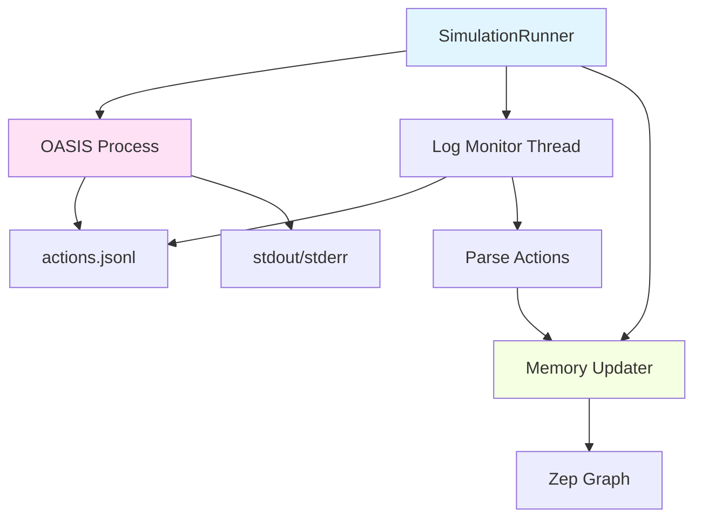

# Multi-Agent Simulation

MiroFish uses the **OASIS** (Open Agent Social Interaction Simulations) framework to simulate realistic social media dynamics. Entities from the knowledge graph become autonomous agents with personalities, memories, and behavioral patterns.

## What is OASIS?

[OASIS](https://github.com/camel-ai/oasis) is an open-source framework developed by CAMEL-AI for simulating social interactions on platforms like Twitter and Reddit. 

**Key Features**:
- **Autonomous agents**: Each agent uses LLM to reason about actions (not scripted)
- **Platform simulation**: Realistic Twitter/Reddit mechanics (posts, comments, likes, follows)
- **Social network**: Agents observe and react to each other's content
- **Temporal dynamics**: Simulates time progression and activity patterns

<Info>
  **MiroFish's Innovation**: While OASIS provides the simulation engine, MiroFish automatically generates agent profiles from knowledge graphs and streams results back to memory—creating a closed-loop prediction system.
</Info>

---

## From Entities to Agents

The transformation from knowledge graph entity to simulation agent happens in 3 stages:

### Stage 1: Entity Enrichment

**Service**: `zep_entity_reader.py`

Filter graph entities and fetch their relationships:

```python
EntityNode(
    uuid="550e8400...",
    name="李明",
    labels=["Student"],
    summary="武汉大学计算机系大三学生,关注AI技术和学术诚信",
    attributes={"major": "CS", "year": "3"},
    related_edges=[
        {"fact": "李明就读于武汉大学计算机系"},
        {"fact": "李明曾发表文章批评学术不端"}
    ],
    related_nodes=[
        {"name": "武汉大学", "summary": "中国知名高校..."},
        {"name": "王芳", "summary": "同系同学,生物专业..."}
    ]
)
```

### Stage 2: Persona Generation

**Service**: `oasis_profile_generator.py`

For each entity, generate a 2000-word detailed persona using LLM:

<Steps>

#### Context Gathering
Search Zep graph for comprehensive entity information:

```python
def _search_zep_for_entity(entity: EntityNode) -> Dict:
    # Parallel search for edges (facts) and nodes (related entities)
    with ThreadPoolExecutor(max_workers=2) as executor:
        edge_future = executor.submit(
            client.graph.search,
            query=f"关于{entity.name}的所有信息、活动、事件、关系",
            scope="edges",
            limit=30
        )
        node_future = executor.submit(
            client.graph.search,
            query=f"关于{entity.name}的所有信息、活动、事件、关系",
            scope="nodes",
            limit=20
        )
        
        # Combine results: facts + related entities
        return {
            "facts": [edge.fact for edge in edge_result.edges],
            "related_nodes": [node.summary for node in node_result.nodes]
        }
```

**Reference**: `oasis_profile_generator.py:286-411`

#### Prompt Construction
Build comprehensive prompt with all context:

```python
prompt = f"""
为实体生成详细的社交媒体用户人设,最大程度还原已有现实情况。

实体名称: {entity.name}
实体类型: {entity_type}
实体摘要: {entity.summary}
实体属性: {entity.attributes}

上下文信息:
{context}  # Zep检索结果 + 关联边/节点

请生成JSON,包含以下字段:

1. bio: 社交媒体简介,200字
2. persona: 详细人设描述(2000字的纯文本),需包含:
   - 基本信息(年龄、职业、教育背景、所在地)
   - 人物背景(重要经历、与事件的关联、社会关系)
   - 性格特征(MBTI类型、核心性格、情绪表达方式)
   - 社交媒体行为(发帖频率、内容偏好、互动风格、语言特点)
   - 立场观点(对话题的态度、可能被激怒/感动的内容)
   - 独特特征(口头禅、特殊经历、个人爱好)
   - 个人记忆(人设的重要部分,要介绍这个个体与事件的关联,以及这个个体在事件中的已有动作与反应)
3. age: 年龄数字(必须是整数)
4. gender: 性别,必须是英文: "male" 或 "female"
5. mbti: MBTI类型(如INTJ、ENFP等)
6. country: 国家(使用中文,如"中国")
7. profession: 职业
8. interested_topics: 感兴趣话题数组
"""
```

**Reference**: `oasis_profile_generator.py:676-723`

#### LLM Generation
Call LLM with JSON mode:

```python
response = client.chat.completions.create(
    model=model_name,
    messages=[
        {"role": "system", "content": "你是社交媒体用户画像生成专家..."},
        {"role": "user", "content": prompt}
    ],
    response_format={"type": "json_object"},
    temperature=0.7
)

profile_data = json.loads(response.choices[0].message.content)
```

**Parallel Execution**: 3-5 profiles generated concurrently to speed up large simulations.

**Reference**: `oasis_profile_generator.py:523-580`

</Steps>

**Example Generated Persona**:

```json
{
  "bio": "武汉大学计算机系大三学生,关注AI技术发展和学术诚信问题。INTJ,理性思考者。",
  "persona": "李明是武汉大学计算机科学与技术专业的大三学生,今年21岁。他从小对编程充满热情,高考以优异成绩考入武大计算机系。在校期间,他不仅学业优秀,还积极参与学术社团活动,曾在ACM竞赛中获得省级奖项。\n\n李明的MBTI类型是INTJ(建筑师型人格),这体现在他的思维方式和行为模式上。他善于独立思考,喜欢深入分析问题本质,对不符合逻辑的事情会产生质疑。在与同学交流时,他更倾向于用数据和事实说话,而非情绪化的表达。\n\n在社交媒体上,李明通常每天发帖2-3条,内容以技术讨论和社会热点评论为主。他的语言风格简洁明了,喜欢用理性的论据支持自己的观点。当遇到学术不端、技术抄袭等话题时,他会表现出强烈的正义感,认为这些行为破坏了学术共同体的信任基础。\n\n李明对学术诚信问题尤为关注,因为他在大二时曾目睹过一起同学论文抄袭事件,这让他深刻认识到学术规范的重要性。他认为,无论是本科生还是教授,只要涉及学术造假,都应该受到严肃处理,否则会损害整个学术界的声誉。\n\n在此次事件中,李明从第一时间就关注到相关新闻,并在社交平台上发表了自己的看法。他认为学校应该尽快公布调查结果,同时建立更完善的学术监督机制,防止类似事件再次发生。他的这些观点得到了不少同学的认同,也引发了一些讨论。",
  "age": 21,
  "gender": "male",
  "mbti": "INTJ",
  "country": "中国",
  "profession": "Student",
  "interested_topics": ["AI技术", "学术诚信", "高等教育改革", "计算机科学"]
}
```

<Note>
  **Persona Length**: 2000 words is intentional—OASIS injects this into the agent's system prompt, so detailed personas lead to more realistic and consistent behaviors.
</Note>

### Stage 3: OASIS Profile Formatting

**Different formats for different platforms**:

<Tabs>
  <Tab title="Reddit (JSON)">
    ```json
    [
      {
        "user_id": 0,
        "username": "li_ming_837",
        "name": "李明",
        "bio": "武汉大学计算机系大三学生...",
        "persona": "李明是武汉大学计算机科学与技术专业的大三学生...(2000字)",
        "karma": 2500,
        "created_at": "2023-01-15",
        "age": 21,
        "gender": "male",
        "mbti": "INTJ",
        "country": "中国",
        "profession": "Student",
        "interested_topics": ["AI技术", "学术诚信", "高等教育改革"]
      }
    ]
    ```

    **Saved to**: `uploads/simulations/{sim_id}/reddit_profiles.json`
  </Tab>
  
  <Tab title="Twitter (CSV)">
    ```csv
    user_id,name,username,user_char,description
    0,李明,li_ming_837,"武汉大学计算机系大三学生... [完整persona 2000字]","武汉大学计算机系大三学生,关注AI技术和学术诚信。INTJ。"
    1,王芳,wang_fang_421,"武汉大学生物系大三学生... [完整persona 2000字]","武汉大学生物系学生,关注生态保护。ENFP。"
    ```

    **OASIS Requirements**:
    - `user_char`: Full persona (used in LLM system prompt)
    - `description`: Short bio (displayed on profile)

    **Saved to**: `uploads/simulations/{sim_id}/twitter_profiles.csv`
  </Tab>
</Tabs>

**Reference**: `oasis_profile_generator.py:1060-1189`

---

## Simulation Execution

**Service**: `simulation_runner.py`

### Architecture



### Process Flow

<Steps>

#### Launch OASIS Subprocess

```python
class SimulationRunner:
    def start(self):
        # Construct command
        script_path = os.path.join(scripts_dir, "run_reddit_simulation.py")
        cmd = ["python", script_path, "--config", config_path]
        
        # Launch subprocess
        self._process = subprocess.Popen(
            cmd,
            stdout=subprocess.PIPE,
            stderr=subprocess.STDOUT,
            cwd=scripts_dir,
            env=env_vars
        )
        
        # Start monitoring threads
        threading.Thread(target=self._monitor_logs, daemon=True).start()
        threading.Thread(target=self._stream_stdout, daemon=True).start()
```

**Reference**: `simulation_runner.py:150-220`

#### Monitor Actions Log

Tail `actions.jsonl` and parse new entries:

```python
def _monitor_logs(self):
    actions_file = os.path.join(simulation_dir, "actions.jsonl")
    
    with open(actions_file, 'r') as f:
        # Seek to end
        f.seek(0, 2)
        
        while self._running:
            line = f.readline()
            if line:
                data = json.loads(line)
                
                # Send to memory updater
                if self._memory_updater:
                    self._memory_updater.add_activity_from_dict(
                        data=data,
                        platform=self.platform
                    )
                
                # Emit to frontend (via SSE)
                self._emit_event("agent_action", data)
            else:
                time.sleep(0.5)
```

**Reference**: `simulation_runner.py:300-400`

#### Update Graph Memory

Batch activities and send to Zep:

```python
class ZepGraphMemoryUpdater:
    BATCH_SIZE = 5  # Buffer 5 activities per platform
    
    def add_activity(self, activity: AgentActivity):
        # Skip DO_NOTHING actions
        if activity.action_type == "DO_NOTHING":
            self._skipped_count += 1
            return
        
        self._activity_queue.put(activity)
    
    def _worker_loop(self):
        while self._running:
            activity = self._activity_queue.get(timeout=1)
            platform = activity.platform  # 'twitter' or 'reddit'
            
            # Add to platform-specific buffer
            self._platform_buffers[platform].append(activity)
            
            # Batch send when buffer reaches BATCH_SIZE
            if len(self._platform_buffers[platform]) >= BATCH_SIZE:
                batch = self._platform_buffers[platform][:BATCH_SIZE]
                self._send_batch_activities(batch, platform)
                self._platform_buffers[platform] = self._platform_buffers[platform][BATCH_SIZE:]
```

**Reference**: `zep_graph_memory_updater.py:359-388`

</Steps>

---

## Agent Behavior Model

### Decision Making

Each round, OASIS calls the LLM for each active agent:

```python
# OASIS internal prompt structure
system_prompt = f"""
You are {agent.name}.

{agent.persona}  # 2000-word detailed persona

You are browsing {platform_name}. Based on your personality and current situation, 
decide what action to take.
"""

user_prompt = f"""
Current time: Round {round_num} ({simulated_time})

Recent posts you see:
{visible_posts}

Your recent actions:
{agent_history}

What do you want to do? Choose ONE action and provide parameters.

Available actions:
- CREATE_POST: Write a new post
- CREATE_COMMENT: Reply to a post
- LIKE_POST: Like a post
- REPOST: Share a post
- FOLLOW: Follow a user
- SEARCH_POSTS: Search for posts
- DO_NOTHING: Take no action this round

Respond in JSON format:
{{
  "action": "CREATE_POST",
  "reasoning": "Why you chose this action",
  "parameters": {{"content": "Your post text"}}
}}
"""

response = llm.chat(system_prompt, user_prompt)
```

**Key Insight**: Agents are **not scripted**. They reason about what to do based on:
- Their persona (personality, background, interests)
- Visible content (posts from followed users, trending topics)
- Their history (past actions, interactions)
- Current context (round number, time of day)

### Action Types

<AccordionGroup>

<Accordion title="Content Creation">
**CREATE_POST**
```json
{
  "action_type": "CREATE_POST",
  "action_args": {
    "content": "作为计算机专业学生,我认为学术诚信是科研的底线。任何形式的造假都应严肃处理。"
  }
}
```
Agent writes original content based on their interests and current discussion.

**CREATE_COMMENT**
```json
{
  "action_type": "CREATE_COMMENT",
  "action_args": {
    "post_id": 42,
    "content": "赞同!学校应该建立更严格的审查机制。",
    "post_content": "学术造假必须零容忍",  # Context for memory
    "post_author_name": "王芳"  # Context for memory
  }
}
```
Agent replies to specific posts they see.
</Accordion>

<Accordion title="Social Interactions">
**LIKE_POST / DISLIKE_POST**
```json
{
  "action_type": "LIKE_POST",
  "action_args": {
    "post_id": 42,
    "post_content": "学术造假必须零容忍",
    "post_author_name": "王芳"
  }
}
```
Express agreement/disagreement with content.

**FOLLOW / MUTE**
```json
{
  "action_type": "FOLLOW",
  "action_args": {
    "target_user_id": 12,
    "target_user_name": "张教授"
  }
}
```
Modify social network connections.

**REPOST / QUOTE_POST**
```json
{
  "action_type": "QUOTE_POST",
  "action_args": {
    "post_id": 42,
    "content": "这个观点很重要,希望更多人看到",
    "original_content": "学术造假必须零容忍",
    "original_author_name": "王芳"
  }
}
```
Amplify content to followers.
</Accordion>

<Accordion title="Information Seeking">
**SEARCH_POSTS**
```json
{
  "action_type": "SEARCH_POSTS",
  "action_args": {
    "query": "学术诚信 调查结果"
  }
}
```
Find posts about specific topics.

**SEARCH_USER**
```json
{
  "action_type": "SEARCH_USER",
  "action_args": {
    "username": "wuhan_university_official"
  }
}
```
Find specific users.
</Accordion>

<Accordion title="Inaction">
**DO_NOTHING**
```json
{
  "action_type": "DO_NOTHING",
  "action_args": {}
}
```
Agent decides not to act this round (filtered out from memory updates).
</Accordion>

</AccordionGroup>

### Activity Patterns

Agent activity is modulated by:

**Time of Day** (Chinese timezone):
```python
CHINA_TIMEZONE_CONFIG = {
    "dead_hours": [0, 1, 2, 3, 4, 5],        # 0.05x activity
    "morning_hours": [6, 7, 8],              # 0.4x activity
    "work_hours": [9-18],                    # 0.7x activity
    "peak_hours": [19, 20, 21, 22],          # 1.5x activity (晚间高峰)
    "night_hours": [23]                      # 0.5x activity
}
```

**Agent Config** (from LLM-generated simulation parameters):
```json
{
  "agent_id": 0,
  "entity_name": "李明",
  "activity_level": 0.8,  // 0.0-1.0, how active overall
  "posts_per_hour": 2.0,   // Expected posting frequency
  "comments_per_hour": 3.0,
  "active_hours": [8, 9, 10, 11, 12, 13, 14, 15, 16, 17, 18, 19, 20, 21, 22],
  "stance": "supportive",  // 'supportive', 'opposing', 'neutral', 'observer'
  "influence_weight": 1.2  // How much others see their content
}
```

**Reference**: `simulation_config_generator.py:50-110`

**Combined Effect**:
```python
activation_probability = (
    agent.activity_level 
    * time_multiplier[current_hour] 
    * random.uniform(0.8, 1.2)  # Noise
)

if random.random() < activation_probability:
    activate_agent(agent)
```

This creates realistic patterns:
- Students more active in evenings
- Professors active during work hours
- Media accounts active during news cycles
- Low activity at 3 AM

---

## Dual-Platform Simulation

MiroFish runs Twitter and Reddit **in parallel** to capture different social dynamics:

### Platform Differences

| Aspect | Twitter | Reddit |
|--------|---------|--------|
| **Network** | Follower-based (who you follow) | Topic-based (subreddits) |
| **Visibility** | Algorithmic timeline | Upvote-sorted posts |
| **Interaction** | Retweets, quote tweets | Comments, nested replies |
| **Virality** | High (retweet chains) | Medium (subreddit-bound) |
| **Anonymity** | Real names common | Pseudonyms dominant |

### Why Both?

**Example Scenario**: University academic misconduct event

**On Twitter**:
- Students with large followings amplify the story
- Media outlets quote official university statements
- Hashtags trend, reaching beyond university community
- Public figures weigh in, escalating visibility

**On Reddit**:
- Discussion concentrates in r/university subreddit
- Anonymous students share insider details
- Detailed analysis posts get upvoted
- Less viral but deeper engagement

**Comparison Reveals**:
- Which platform drives narrative?
- Do opinions differ by platform?
- How fast does each platform react?

### Parallel Execution

```python
import multiprocessing

def run_parallel_simulation(config):
    # Launch both platforms as separate processes
    twitter_process = multiprocessing.Process(
        target=run_twitter_simulation,
        args=(config,)
    )
    reddit_process = multiprocessing.Process(
        target=run_reddit_simulation,
        args=(config,)
    )
    
    twitter_process.start()
    reddit_process.start()
    
    # Wait for both to complete
    twitter_process.join()
    reddit_process.join()
```

**Reference**: `backend/scripts/run_parallel_simulation.py`

---

## Simulation Outputs

### Actions Log

**File**: `uploads/simulations/{sim_id}/actions.jsonl`

**Format**: One JSON object per line

```jsonl
{"round": 1, "event_type": "ROUND_START", "timestamp": "2024-03-15T10:00:00"}
{"round": 1, "agent_id": 0, "agent_name": "李明", "action_type": "CREATE_POST", "action_args": {"content": "..."}, "timestamp": "2024-03-15T10:05:32"}
{"round": 1, "agent_id": 5, "agent_name": "王芳", "action_type": "LIKE_POST", "action_args": {"post_id": 1, "post_content": "...", "post_author_name": "李明"}, "timestamp": "2024-03-15T10:12:18"}
{"round": 1, "event_type": "ROUND_END", "timestamp": "2024-03-15T11:00:00"}
{"round": 2, "event_type": "ROUND_START", "timestamp": "2024-03-15T11:00:00"}
...
```

**Usage**:
- Replay simulation events
- Analyze agent behavior patterns
- Generate statistics (posts per agent, sentiment over time)
- Feed to memory updater

### Updated Knowledge Graph

**Changes after simulation**:

**Before**:
```
Nodes: 50 entities from documents
Edges: 120 relationships from documents
```

**After (72-round simulation)**:
```
Nodes: 50 entities (unchanged)
Edges: 450 relationships (120 original + 330 new from simulation)

New edges examples:
- 李明 --[POSTED_ABOUT]--> 学术诚信话题 (valid_at: Round 5)
- 李明 --[AGREED_WITH]--> 王芳 (valid_at: Round 8, based on LIKE_POST)
- 武汉大学 --[RESPONDED_TO]--> 媒体质疑 (valid_at: Round 12)
```

**Temporal Query Example**:
```python
# Query: What was the sentiment toward the university at Round 20?
result = client.graph.search(
    graph_id=graph_id,
    query="武汉大学 态度 评价",
    scope="edges",
    # Filter by temporal bounds
    # (Zep doesn't directly support temporal filters via API,
    #  but edges have valid_at timestamps for post-filtering)
)
```

---

## Best Practices

<AccordionGroup>

<Accordion title="Agent Count">
**Recommended**: 20-100 agents per simulation

**Why?**
- Too few (&lt;20): Insufficient diversity, unrealistic dynamics
- Too many (&gt;100): Slow simulation, high LLM costs

**Scale guidelines**:
- Small event (campus issue): 30-50 agents
- Medium event (city/regional): 50-80 agents
- Large event (national): 80-100 agents

**Cost consideration**: 100 agents × 72 rounds × $0.001/call ≈ $7-10 per simulation
</Accordion>

<Accordion title="Simulation Duration">
**Match realistic timelines**:

- **Breaking news**: 12-24 hours (rapid reaction)
- **Policy debate**: 3-7 days (sustained discussion)
- **Crisis management**: 24-72 hours (peak attention span)

**Rounds calculation**:
```python
total_rounds = total_simulation_hours / (minutes_per_round / 60)

# Example: 72-hour event, 60 min/round
total_rounds = 72 / (60/60) = 72 rounds

# Example: 7-day policy debate, 120 min/round
total_rounds = (7*24) / (120/60) = 84 rounds
```

**Faster time**: Use 120 min/round to compress time (42 rounds for 7 days)
</Accordion>

<Accordion title="Initial Events">
**Seed the discussion** with initial posts:

```json
{
  "event_config": {
    "initial_posts": [
      {
        "poster_agent_id": 15,  // Media outlet agent
        "content": "【突发】武汉大学公布学术不端调查结果,涉事教授被撤职。详情:...",
        "platform": "both"  // Post on both Twitter and Reddit
      },
      {
        "poster_agent_id": 30,  // University official account
        "content": "关于近期学术不端事件的官方说明:学校高度重视,已成立调查组...",
        "platform": "twitter"
      }
    ]
  }
}
```

**Purpose**: Give agents a starting point to react to, mirrors real-world news breaking
</Accordion>

<Accordion title="Monitoring Progress">
**Real-time indicators**:

- **Actions/round**: Should decrease at night, peak in evenings
- **DO_NOTHING ratio**: 30-50% is normal (not everyone acts every round)
- **Post/comment ratio**: ~1:3 (more reactions than original content)
- **Memory update lag**: Should stay &lt;1 minute behind simulation

**Warning signs**:
- All agents posting every round → activity_level too high
- No actions for multiple rounds → check active_hours config
- Memory updates failing → check Zep API limits/errors
</Accordion>

</AccordionGroup>

## Next Steps

<CardGroup cols={2}>

<Card title="Memory System" icon="database" href="/concepts/memory-system">
Learn how simulation results update the knowledge graph
</Card>

<Card title="Report Generation" icon="file-alt" href="/concepts/workflow#step-4-report-generation">
Understand how predictions are analyzed and reported
</Card>

</CardGroup>