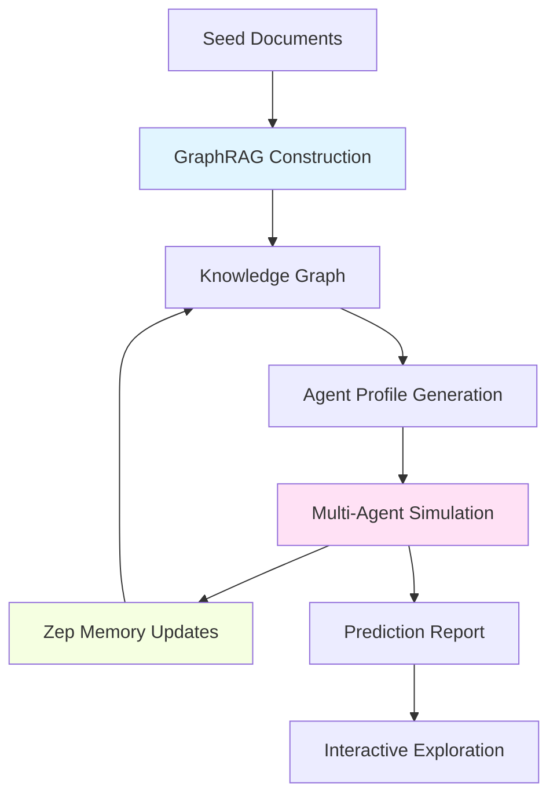

# Architecture Overview

MiroFish is a next-generation AI prediction engine powered by multi-agent technology. It constructs high-fidelity parallel digital worlds from real-world seed information, where thousands of intelligent agents with independent personalities interact and evolve to predict future trajectories.

## System Architecture

MiroFish combines three cutting-edge technologies to create a complete prediction pipeline:

## Core Components

### 1. Knowledge Graph Layer (GraphRAG + Zep Cloud)

**Purpose**: Extract and store structured knowledge from unstructured text

**Key Services**:
- `ontology_generator.py`: Analyzes documents to design entity/relationship types
- `graph_builder.py`: Constructs knowledge graphs using Zep Cloud API
- `zep_entity_reader.py`: Reads and filters entities from the graph

**Technology**: 
- Zep Cloud's GraphRAG capabilities automatically extract entities, relationships, and facts
- Custom ontology design ensures entities are "social media actors" (people, organizations, media)
- Temporal edges track relationships over time

<Info>
  **Why GraphRAG?** Traditional RAG retrieves documents, but GraphRAG understands the network of relationships between entities, enabling more nuanced social simulation.
</Info>

### 2. Agent Simulation Layer (OASIS)

**Purpose**: Simulate social media interactions across parallel platforms

**Key Services**:
- `oasis_profile_generator.py`: Converts graph entities into detailed agent personas
- `simulation_manager.py`: Orchestrates the entire simulation lifecycle
- `simulation_runner.py`: Executes Twitter/Reddit simulations via OASIS

**Technology**:
- [OASIS](https://github.com/camel-ai/oasis) framework for social simulation
- Dual-platform parallel simulation (Twitter + Reddit)
- Each entity becomes an autonomous agent with personality, memory, and behavior patterns

<Note>
  OASIS agents don't follow scripts—they reason about their situation using LLMs and decide actions based on their persona and the social context.
</Note>

### 3. Memory System Layer (Zep Cloud)

**Purpose**: Maintain long-term memory and update knowledge with simulation results

**Key Services**:
- `zep_graph_memory_updater.py`: Streams agent activities back to the knowledge graph
- `zep_tools.py`: Provides search and retrieval tools for the Report Agent

**Technology**:
- Zep Cloud's temporal memory system
- Real-time graph updates during simulation
- Semantic search across facts, entities, and events

### 4. Analysis Layer (Report Agent)

**Purpose**: Generate prediction reports and enable interactive exploration

**Key Services**:
- `report_agent.py`: ReAct-style agent with access to Zep tools
- `simulation_config_generator.py`: Auto-generates simulation parameters from requirements

**Technology**:
- LangChain-style ReAct loop for multi-step reasoning
- Access to Zep search, InsightForge, and Panorama tools
- Conversational interface for post-simulation Q&A

## Data Flow

The complete prediction workflow follows this sequence:

<Steps>

### Graph Construction
Upload seed documents → LLM analyzes content → Generate ontology → Extract entities/relationships → Build Zep knowledge graph

### Environment Setup  
Read graph entities → Filter by type → Generate detailed agent personas → Create OASIS profiles → Configure simulation parameters

### Parallel Simulation
Launch Twitter & Reddit simulations → Agents post, comment, react → Activities logged → Real-time memory updates to Zep

### Report Generation
ReAct agent analyzes simulation → Searches graph for evidence → Generates structured report → Saves predictions

### Interactive Exploration
Chat with any simulated agent → Ask Report Agent questions → Query updated knowledge graph → Explore alternative scenarios

</Steps>

## Technology Stack

<CardGroup cols={2}>

<Card title="Backend" icon="server">
- **Framework**: FastAPI (Python)
- **LLM Client**: OpenAI-compatible API
- **Graph DB**: Zep Cloud GraphRAG
- **Simulation**: OASIS (CAMEL-AI)
</Card>

<Card title="Frontend" icon="browser">
- **Framework**: Next.js 14
- **UI**: React + TailwindCSS
- **Real-time**: Server-Sent Events
- **Visualization**: React Flow, Chart.js
</Card>

</CardGroup>

## Key Design Principles

### 1. Fully Automated Pipeline

MiroFish minimizes manual configuration:
- LLM designs the ontology from document analysis
- Agent personas generated automatically from graph entities
- Simulation parameters inferred from requirements
- Reports written autonomously by ReAct agent

### 2. Temporal Awareness

Time is a first-class citizen:
- Knowledge graph tracks relationship changes over time
- Simulation respects realistic timelines (e.g., 72-hour social media cycle)
- Memory updates preserve chronological order
- Reports reference specific temporal snapshots

### 3. Grounded in Reality

Every prediction is traceable:
- Entities must exist in source documents
- Agent behaviors derived from real relationships
- Simulation activities reference original facts
- Report claims cite specific graph evidence

### 4. Scalable Intelligence

Designed for large-scale simulation:
- Parallel profile generation (concurrent LLM calls)
- Dual-platform simulation (Twitter + Reddit simultaneously)  
- Batch memory updates (5 activities per Zep request)
- Streaming report generation (section-by-section)

## Service Reference

All core services live in `backend/app/services/`:

| Service | Purpose | Key Methods |
|---------|---------|-------------|
| `ontology_generator.py` | Design entity/relationship types | `generate()` |
| `graph_builder.py` | Build Zep knowledge graphs | `build_graph_async()`, `set_ontology()` |
| `zep_entity_reader.py` | Read/filter graph entities | `filter_defined_entities()` |
| `oasis_profile_generator.py` | Create agent personas | `generate_profiles_from_entities()` |
| `simulation_manager.py` | Orchestrate simulations | `create_simulation()`, `prepare_simulation()` |
| `simulation_runner.py` | Execute OASIS simulations | `start()`, `stop()` |
| `zep_graph_memory_updater.py` | Update graph with activities | `add_activity()`, `_send_batch_activities()` |
| `report_agent.py` | Generate prediction reports | `plan_outline()`, `generate_section()` |

## Next Steps

<CardGroup cols={2}>

<Card title="5-Step Workflow" icon="route" href="/concepts/workflow">
Learn the detailed process from documents to predictions
</Card>

<Card title="Knowledge Graph" icon="network-wired" href="/concepts/knowledge-graph">
Understand GraphRAG construction and ontology design
</Card>

<Card title="Multi-Agent Simulation" icon="users" href="/concepts/multi-agent-simulation">
Explore OASIS integration and agent behaviors
</Card>

<Card title="Memory System" icon="database" href="/concepts/memory-system">
Discover Zep Cloud's temporal memory capabilities
</Card>

</CardGroup>