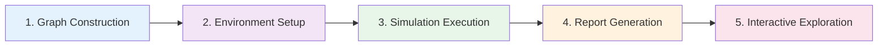

# The 5-Step Workflow

MiroFish transforms raw documents into actionable predictions through a fully automated 5-step pipeline. Each step builds upon the previous, creating a digital mirror of reality where the future can be rehearsed.

## Workflow Overview



---

## Step 1: Graph Construction

**Goal**: Extract structured knowledge from unstructured seed documents

**Inputs**:
- Seed documents (news reports, research papers, stories)
- Simulation requirement (user's prediction question)

**Process**:

<Steps>

### Ontology Generation
LLM analyzes document content and designs custom entity/relationship types

**Service**: `ontology_generator.py`

**Output**: 10 entity types (8 specific + 2 fallback) + 6-10 relationship types

**Example**:
```json
{
  "entity_types": [
    {"name": "Student", "description": "University student..."},
    {"name": "Professor", "description": "Academic faculty..."},
    {"name": "University", "description": "Higher education institution..."},
    ...
    {"name": "Person", "description": "Fallback for any individual"},
    {"name": "Organization", "description": "Fallback for any group"}
  ],
  "edge_types": [
    {"name": "WORKS_FOR", "source_targets": [{"source": "Person", "target": "Organization"}]},
    {"name": "STUDIES_AT", "source_targets": [{"source": "Student", "target": "University"}]}
  ]
}
```

### Text Chunking
Document split into overlapping chunks (500 tokens, 50 overlap)

**Service**: `text_processor.py`

### Zep Graph Building
Chunks sent to Zep Cloud in batches, entities/relationships extracted automatically

**Service**: `graph_builder.py`

**Key Code** (`graph_builder.py:288`):
```python
def add_text_batches(self, graph_id: str, chunks: List[str], batch_size: int = 3):
    """Send chunks to Zep in batches, return episode UUIDs"""
    episode_uuids = []
    for i in range(0, len(chunks), batch_size):
        batch_chunks = chunks[i:i + batch_size]
        episodes = [EpisodeData(data=chunk, type="text") for chunk in batch_chunks]
        batch_result = self.client.graph.add_batch(graph_id=graph_id, episodes=episodes)
        episode_uuids.extend([ep.uuid_ for ep in batch_result])
        time.sleep(1)  # Rate limiting
    return episode_uuids
```

### Processing Wait
Poll Zep until all episodes are processed

**Reference**: `graph_builder.py:341-395`

</Steps>

**Outputs**:
- Zep Cloud knowledge graph ID
- Node count, edge count, entity types
- GraphRAG-ready for semantic search

<Info>
  **GraphRAG vs Traditional Extraction**: Zep doesn't just find entities—it understands their relationships, temporal changes, and hierarchical structures. This enables the simulation to model realistic social dynamics.
</Info>

---

## Step 2: Environment Setup

**Goal**: Transform graph entities into simulation-ready agents with rich personas

**Process**:

<Steps>

### Entity Filtering
Read all nodes from Zep graph and filter by defined types

**Service**: `zep_entity_reader.py`

**Key Code** (`zep_entity_reader.py:116`):
```python
def filter_defined_entities(self, graph_id: str, defined_entity_types: List[str]):
    """Fetch all nodes, keep only those matching defined types, enrich with edges"""
    all_nodes = fetch_all_nodes(self.client, graph_id)
    filtered_entities = []
    for node in all_nodes:
        entity_type = self._extract_entity_type(node)
        if entity_type in defined_entity_types:
            # Fetch related edges and nodes for this entity
            entity = self._build_entity_node(node, graph_id)
            filtered_entities.append(entity)
    return FilteredEntities(entities=filtered_entities, ...)
```

### Persona Generation (Parallel)
For each entity, generate detailed persona using LLM + Zep search

**Service**: `oasis_profile_generator.py`

**Parallel Execution** (`oasis_profile_generator.py:850-1009`):
```python
with ThreadPoolExecutor(max_workers=parallel_count) as executor:
    # Submit all profile generation tasks
    for idx, entity in enumerate(entities):
        future = executor.submit(generate_single_profile, idx, entity)
        # Each worker:
        #   1. Search Zep for entity context (edges + nodes)
        #   2. Build persona prompt with 2000-word requirements
        #   3. Call LLM to generate bio, age, MBTI, interests, etc.
        #   4. Save profile immediately (real-time output)
```

**Persona Details**:
- **Bio**: 200-character social media description
- **Persona**: 2000-word detailed backstory (background, personality, social media behavior, stance on issues)
- **Demographics**: Age, gender, MBTI, country, profession
- **Interests**: Array of topic keywords

**Example Output** (logged to console):
```
----------------------------------------------------------------------
[已生成] 李明 (Student)
----------------------------------------------------------------------
User: li_ming_837

【简介】
武汉大学计算机系大三学生，关注AI技术发展和学术诚信问题。

【详细人设】
李明是武汉大学计算机科学与技术专业的大三学生，今年21岁。他从小对编程充满热情...
（性格特征）他是INTJ型人格，理性、独立思考...
（社交媒体行为）在社交平台上，他每天平均发帖2-3条，主要关注AI技术进展...
（立场观点）对学术不端行为持坚决反对态度...

【基本属性】
年龄: 21 | 性别: male | MBTI: INTJ
职业: Student | 国家: 中国
兴趣话题: AI技术, 学术诚信, 高等教育改革
----------------------------------------------------------------------
```

### Simulation Config Generation
LLM analyzes requirements and auto-generates parameters

**Service**: `simulation_config_generator.py`

**Generated Parameters**:
- **Time Config**: Total hours (72h default), minutes per round (60), peak/off-peak hours
- **Event Config**: Initial posts to seed discussion, scheduled events, hot topics
- **Agent Configs**: Activity level, posting frequency, active hours, stance, influence weight
- **Platform Configs**: Recommendation algorithm weights, viral thresholds

</Steps>

**Outputs**:
- `reddit_profiles.json`: All agent personas in OASIS-compatible format
- `twitter_profiles.csv`: CSV format for Twitter simulation
- `simulation_config.json`: Complete parameter set

<Note>
  **Real-time Saving**: Profiles are written to disk immediately upon generation, allowing frontend to display progress and enabling resume if interrupted.
</Note>

---

## Step 3: Simulation Execution

**Goal**: Run parallel social media simulations with autonomous agents

**Platforms**: Twitter + Reddit (dual-platform simultaneous execution)

**Process**:

<Steps>

### Simulation Launch
Start OASIS simulation runners for both platforms

**Service**: `simulation_runner.py`

**Key Architecture** (`simulation_runner.py:50-200`):
```python
class SimulationRunner:
    def start(self):
        # Launch OASIS subprocess
        self._process = subprocess.Popen(
            ["python", script_path, "--config", config_path],
            stdout=subprocess.PIPE,
            stderr=subprocess.STDOUT
        )
        
        # Start log monitoring thread
        threading.Thread(target=self._monitor_logs, daemon=True).start()
        
        # Start memory updater (sends activities to Zep)
        self._memory_updater = ZepGraphMemoryManager.create_updater(
            simulation_id, graph_id
        )
```

### Round-by-Round Execution
Each round simulates 1 hour of social media activity

**Agent Actions** (from OASIS framework):
- `CREATE_POST`: Publish original content
- `CREATE_COMMENT`: Reply to posts
- `LIKE_POST`, `DISLIKE_POST`: React to content
- `REPOST`, `QUOTE_POST`: Share with/without commentary
- `FOLLOW`, `MUTE`: Modify social connections
- `SEARCH_POSTS`, `SEARCH_USER`: Information seeking

**Activity Logging**: All actions written to `actions.jsonl`

**Example Log Entry**:
```json
{
  "round": 5,
  "agent_id": 12,
  "agent_name": "李明",
  "action_type": "CREATE_POST",
  "action_args": {
    "content": "作为计算机专业学生,我认为学术诚信是科研的底线。任何形式的造假都应严肃处理。"
  },
  "timestamp": "2024-03-15T14:32:10"
}
```

### Real-time Memory Updates
Agent activities streamed back to Zep knowledge graph

**Service**: `zep_graph_memory_updater.py`

**Batching Strategy** (`zep_graph_memory_updater.py:390-427`):
```python
class ZepGraphMemoryUpdater:
    BATCH_SIZE = 5  # Accumulate 5 activities before sending
    
    def _worker_loop(self):
        """Background thread batches activities by platform"""
        while self._running:
            activity = self._activity_queue.get(timeout=1)
            platform = activity.platform  # 'twitter' or 'reddit'
            
            self._platform_buffers[platform].append(activity)
            
            if len(self._platform_buffers[platform]) >= BATCH_SIZE:
                batch = self._platform_buffers[platform][:BATCH_SIZE]
                self._send_batch_activities(batch, platform)
```

**Memory Update Format**:
```
li_ming_837: 发布了一条帖子：「作为计算机专业学生,我认为学术诚信是科研的底线...」

zhang_professor_42: 点赞了李明的帖子：「作为计算机专业学生,我认为学术诚信...」

wuhan_university_official: 评论道：「学校高度重视学术诚信建设...」
```

These natural language descriptions are sent to Zep, which extracts new facts and updates entity relationships.

### Progress Monitoring
WebSocket/SSE stream sends updates to frontend

**Events**:
- Round start/complete
- Agent actions (filtered to key events)
- Platform statistics (posts, comments, likes)
- Memory update status

</Steps>

**Outputs**:
- `actions.jsonl`: Complete activity log (all agent actions)
- Updated Zep knowledge graph (new facts, evolved relationships)
- Platform statistics (viral posts, sentiment trends, network changes)

<Info>
  **Why Dual Platforms?** Twitter and Reddit have different dynamics (follower-based vs. topic-based). Running both captures how the same event unfolds in different social ecosystems.
</Info>

---

## Step 4: Report Generation

**Goal**: Analyze simulation results and generate structured prediction report

**Process**:

<Steps>

### Outline Planning
ReAct agent plans report structure based on requirements

**Service**: `report_agent.py`

**Example Outline**:
```json
{
  "title": "武汉大学学术诚信事件舆论演化预测报告",
  "sections": [
    {"title": "事件概述与背景", "description": "回顾事件起因..."},
    {"title": "关键利益相关方立场分析", "description": "学生群体、教授学者、校方..."},
    {"title": "舆论演化趋势预测", "description": "未来72小时内讨论热度、情感走向..."},
    {"title": "风险评估与应对建议", "description": "潜在危机点、舆论引导策略..."}
  ]
}
```

### Section-by-Section Generation
For each section, run ReAct loop with Zep tools

**ReAct Loop** (`report_agent.py:800-1000`):
```python
for iteration in range(MAX_ITERATIONS):
    # 1. LLM decides: need more info or ready to answer?
    response = llm.chat(messages, tools=zep_tools)
    
    if response.has_tool_calls():
        # 2. Execute tool calls (search, InsightForge, Panorama)
        for tool_call in response.tool_calls:
            tool_result = zep_tools.execute(tool_call.name, tool_call.args)
            messages.append({"role": "tool", "content": tool_result})
    
    elif response.has_final_answer():
        # 3. Extract final answer
        section_content = extract_final_answer(response.content)
        break
```

**Available Tools**:
- **search**: Semantic search across graph facts
- **InsightForge**: Analyze entities/relationships for patterns
- **Panorama**: Get high-level overview of graph state
- **Interview**: Query specific entities

**Example Tool Use**:
```
Thought: 需要了解学生群体在模拟中的主要观点
Action: search(query="学生 观点 学术诚信")
Observation: [15条事实] "李明: 发布了帖子'学术诚信是科研底线'", "王芳: 评论道'应该严肃处理'"...

Thought: 现在可以总结学生立场了
Final Answer: 根据模拟结果,学生群体普遍对学术不端持强烈反对态度...
```

### Report Assembly
Combine all sections into markdown report

**Format**:
```markdown
# 武汉大学学术诚信事件舆论演化预测报告

## 事件概述与背景
[Section 1 content with citations]

## 关键利益相关方立场分析
[Section 2 content with graph evidence]

## 舆论演化趋势预测  
[Section 3 content with simulation statistics]

## 风险评估与应对建议
[Section 4 content with actionable recommendations]
```

</Steps>

**Outputs**:
- `report.md`: Complete markdown report
- `report_metadata.json`: Generation details, tool usage stats
- `agent_log.jsonl`: Full ReAct reasoning trace

<Note>
  **Traceable Predictions**: Every claim in the report can be traced back to specific simulation activities or graph facts via the `agent_log.jsonl`.
</Note>

---

## Step 5: Interactive Exploration

**Goal**: Enable users to explore results and ask follow-up questions

**Capabilities**:

### Chat with Simulated Agents
Converse with any agent that participated in simulation

**Implementation**: Load agent persona + activity history, use LLM to role-play

**Example**:
```
User: 李明,你为什么对这个事件这么关注?

Agent: 作为计算机专业的学生,学术诚信直接关系到我们的学习环境和未来发展。
我在模拟中发布了3条相关帖子,还参与了多个讨论,因为我认为...
```

### Chat with Report Agent
Ask questions about the report or simulation

**Implementation**: Same ReAct loop, access to full Zep graph

**Example**:
```
User: 哪些因素最影响舆论走向?

Report Agent: [调用 InsightForge 分析]
根据模拟数据,主要影响因素包括:
1. 校方回应速度 (相关度0.89)
2. 意见领袖表态 (相关度0.76)  
3. 媒体报道角度 (相关度0.71)
详细分析见报告第3章...
```

### Re-run with Modifications
Adjust parameters and run new simulation

**Use Cases**:
- "What if the university responded immediately?"
- "How would sentiment change with more media coverage?"
- "What if there were 2x more students involved?"

**Outputs**:
- Conversational insights beyond static report
- Deeper understanding of causal relationships
- Alternative scenario exploration

---

## Workflow Best Practices

<AccordionGroup>

<Accordion title="Document Quality">
**Input documents should**:
- Contain rich entity information (names, organizations, relationships)
- Include temporal markers (dates, sequences)
- Describe events with multiple perspectives
- Be 5,000-50,000 characters (optimal for ontology generation)

**Avoid**:
- Pure opinion pieces without factual grounding
- Documents with heavy redaction (missing names)
- Machine-translated text with entity ambiguity
</Accordion>

<Accordion title="Simulation Requirements">
**Good requirements**:
- "Predict public reaction to university's academic misconduct handling over 72 hours"
- "Forecast market response to new policy announcement in first week"

**Bad requirements**:
- "Tell me what will happen" (too vague)
- "Predict stock price" (MiroFish models social dynamics, not financial markets)
</Accordion>

<Accordion title="Ontology Design">
**Let LLM design ontology** (don't override) because:
- It ensures entities match document content
- It balances specificity and coverage
- It includes necessary fallback types

**Only intervene if**:
- Ontology has abstract concepts ("Sentiment", "Trend")
- Missing critical actor types from your domain
</Accordion>

<Accordion title="Simulation Duration">
**Duration guidelines**:
- **Social media events**: 24-72 hours (typical news cycle)
- **Policy discussions**: 1-2 weeks (slower evolution)
- **Crisis response**: 12-24 hours (rapid unfolding)

**Rounds = Total Hours / Minutes Per Round**
- 72 hours at 60 min/round = 72 rounds
- More rounds = more detailed but slower simulation
</Accordion>

</AccordionGroup>

## Next Steps

<CardGroup cols={3}>

<Card title="Knowledge Graph Details" icon="network-wired" href="/concepts/knowledge-graph">
Deep dive into GraphRAG and ontology design
</Card>

<Card title="Agent Simulation" icon="users" href="/concepts/multi-agent-simulation">
Understand OASIS integration and agent behaviors  
</Card>

<Card title="Memory System" icon="database" href="/concepts/memory-system">
Learn about Zep's temporal memory updates
</Card>

</CardGroup>